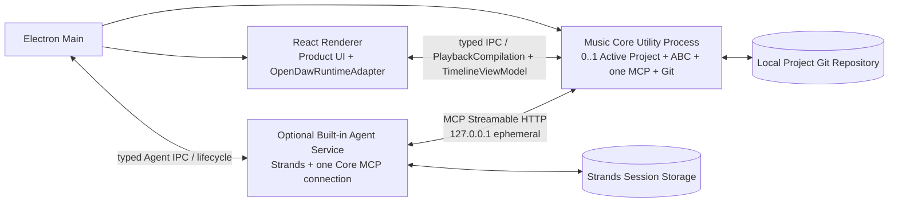

# Agent Music Workstation 系统架构文档

| 项目 | 内容 |
|---|---|
| 架构版本 | V1.17 |
| 需求基线 | Agent Music Workstation PRD V1.19 Export Preparation |
| 状态 | P0 架构基线；跨 RPC 人工确认统一 Operation 模型已冻结 |
| 日期 | 2026-09-12 |
| 首发平台 | Windows 10/11 |
| 核心技术 | Electron、React、TypeScript、openDAW、Strands、MCP、Git/worktree |

> 本版在 V1.15 基线上将 Generation Plan 与 Scope Extension 的人工确认统一建模为可恢复 Operation：P0 Agent MCP Tool 为 10 个，新增通用 `getOperation` / `cancelOperation`，移除专用 `cancelScopeExtension`；Operation 与单次 MCP/RPC 生命周期解耦，transport timeout 不再具有业务取消语义。

---

## 1. 文档目的与范围

本文档定义 Agent Music Workstation P0 的：

- 系统和进程边界；
- Monorepo 与模块职责；
- Canonical ABC、Tick、Scope Mapping 和 openDAW 数据链路；
- Local MCP 的连接、工具和权限模型；
- Current、Candidate、Task 与 Git/worktree 状态机；
- 保存、恢复、试听、导出和安全策略；
- 技术 Gate 与测试边界。

本文档不重新定义产品需求；与 PRD V1.19 冲突时，以 PRD 为准。

---

## 2. 已确认架构决策

| 编号 | 主题 | 决策 |
|---|---|---|
| ADR-001 | 产品形态 | Electron 本地桌面应用，不开发独立 Web 端。 |
| ADR-002 | 桌面 UI | React + TypeScript，运行于 Electron Renderer。 |
| ADR-003 | 音乐工作区 | P0 自研 React 时间轴、Clip 展示、Transport 和连续 Scope；通过 Adapter 使用 openDAW SDK/Core Runtime，不 fork 或内嵌 openDAW Studio UI。 |
| ADR-004 | Piano Roll | P0 不显示；P2 默认自研 React 编辑器，经 Music Core 更新 Canonical ABC 后重建 Runtime，不直接启用 openDAW Studio UI。 |
| ADR-005 | Agent Runtime | Strands 承载单 Agent Loop、会话、计划和有限修复。 |
| ADR-006 | Agent 写入边界 | 所有 Agent 工程写入统一经过 Local MCP。 |
| ADR-007 | 编曲事实来源 | 单一 `composition.abc` 是编曲唯一事实来源。 |
| ADR-008 | Canonical ABC | 保存为完全展开形式，禁止 Repeat 简写。 |
| ADR-009 | Scope Mapping | P0 实现 Tick Range 到 ABC 字符范围映射；Mapping 是缓存，不进入 Git。 |
| ADR-010 | Scope | 内部只保留 `wholeProject` 或 `trackIds + [startTick,endTick)`。 |
| ADR-011 | Current | 创建项目时即产生空白 Current；Current 为 `main` HEAD。 |
| ADR-012 | Candidate | P0 同一项目最多一个业务 Active Candidate，使用独立 branch + worktree；已结束 Candidate 的 PendingCleanup/orphan 不属于可操作 Candidate。 |
| ADR-013 | Task checkpoint | 一个 Task 在 `finishTask` 成功后形成一个 Candidate checkpoint。 |
| ADR-014 | Accept | 将 Candidate 最终树 squash 为一个正式 Current commit。 |
| ADR-015 | 恢复 | 只保证最后成功 Current；P0 不恢复运行 Task 或 Candidate。 |
| ADR-016 | 轨道 | P0 固定六轨，不做动态轨道管理。 |
| ADR-017 | Section | P0 不存在 Section 领域模型或 UI 功能。 |
| ADR-018 | 时间 | P0 使用项目固定 PPQ=960 的整数 Tick，不静默量化。 |
| ADR-019 | 稳定 ID | P0 只持久化项目 ID 和固定 Track ID，不持久化 Note/MIDI/Runtime ID。 |
| ADR-020 | 音色权限 | P0 不开放 Agent 音色/效果器/混音工具；P1 增加。 |
| ADR-021 | 项目文件 | P0 Git 权威文件仅 `project.json` 与 `composition.abc`。 |
| ADR-022 | MCP 进程 | MCP Server 位于 Music Core Utility Process。 |
| ADR-023 | MCP Transport | 使用只监听 localhost 的 Streamable HTTP；P0 不实现 stdio Bridge。 |
| ADR-024 | MCP Endpoint 生命周期 | Music Core 使用一个 Core-process-scoped 随机 localhost 端口和 Instance Token，并在用户运行时目录维护 Core 实例描述文件；Project close/open 不重建 Endpoint。 |
| ADR-025 | MCP 权限 | Instance Token 负责连接；服务器端 TaskContext 负责写入授权。 |
| ADR-026 | 模型协议 | P0 只支持 OpenAI-compatible Chat Completions。 |
| ADR-027 | Agent Session | P0 不使用应用级 SQLite；Agent Session、消息、Tool Call / Tool Result 上下文、恢复与 Context 管理由 Strands Session 能力及其 Storage 负责，不作为工程事实。 |
| ADR-028 | 模型配置 | 用户级 `~/.agent-music/settings.json` 保存 Endpoint、API Key 和参数。 |
| ADR-029 | 试听 | Current/Candidate 各缓存 RuntimeSnapshot，只运行一个 openDAW Runtime。 |
| ADR-030 | 另存为 | 复制 Current 权威文件，生成新项目和新 Git 历史，不保留旧历史。 |
| ADR-031 | UI 写入边界 | React UI 只能产生 Product Scope、Transport 命令和领域编辑命令；不得直接修改 openDAW BoxGraph。 |
| ADR-032 | openDAW UI 策略 | openDAW Studio UI 不进入 P0/P2 默认架构；只有产品范围转为完整 DAW 时才单独评估 fork 或局部移植。 |
| ADR-033 | RuntimeSnapshot 归属 | A2 不生成、不持有 RuntimeSnapshot；B3 在 Renderer 内根据 A2 的 openDAW 无关 `PlaybackCompilation` 构建并缓存 Snapshot。`ScopeMappingCache` 始终留在 Core，是 A2 的独立输出，不进入 RuntimeSnapshot 或 Renderer IPC。 |
| ADR-034 | P0 Velocity | Canonical ABC 使用 `[I:MIDI vol N]`，`N` 为整数 `1..127`；`0` 保留为 Standard MIDI Note Off，不属于 Note onset Velocity。指令绑定恰好一个后续 Note/Chord onset，并与事件进入同一个 Scope span；Chord 内共享 Velocity，Tie continuation 禁止重新设置。缺省 Velocity 为 `100`。 |
| ADR-035 | Musical Properties 修改 | A2 暴露 `updateMusicalProperties`，只接受覆盖全部六轨的 `wholeProject` Scope。P0 支持修改唯一 `M:` 头与初始 `Q:` 头；更新不得改变曲长、Note/Rest、Velocity、Key 或局部 Tempo Event，并重建全部派生输出。Meter 修改不自动重排小节，Tempo 修改不重写局部 Tempo Map。 |
| ADR-036 | A3 Task 边界 | 正式 Task 只在用户确认后由 A3 创建；A3 `TaskContext` 只保存事务与授权状态。planning、awaiting_confirmation、repair policy、用户意图和模型配置属于 A4。 |
| ADR-037 | Candidate 基线与 worktree | Candidate 创建时冻结 `baseRevision=main HEAD`，一个 Candidate 对应一个 `candidate/<candidateId>` branch 与 `.agent-music/worktrees/<candidateId>/` linked worktree；多个 Task 复用同一 worktree。 |
| ADR-038 | Task 调用一致性 | `taskId`/`candidateId` 全局唯一；除 `getTaskContext({taskId})` bootstrap 外，Task-bound MCP 调用统一携带 project/candidate/baseRevision/expectedScopeRevision execution envelope，并由 A3 逐项核对。 |
| ADR-039 | Scope Extension | Scope 只能扩大且满足 `oldScope ⊆ newScope`；A3 是 Scope/scopeRevision 唯一 owner。每个扩展有唯一 requestId，Pending 期间形成写入 barrier。 |
| ADR-040 | Candidate 并发与状态 | Candidate 与 Task 使用独立状态机。普通 mutation 不排队，busy 返回 `TASK_BUSY`；Cancel/Reject 可先失效授权，运行中 mutation 在最终落盘前必须再次检查授权。 |
| ADR-041 | Accept/Reject 事务点 | Accept 以新 `main` commit 成功为业务成功点；Reject 以 Candidate 授权失效为业务成功点。后续 branch/worktree cleanup 失败不回滚业务结果，也不阻塞新 Candidate。 |
| ADR-042 | Candidate cleanup | 已结束 Candidate 通过 `.agent-music/candidate-cleanup/<candidateId>.json` marker 授权自动清理。启动时只自动清理有 marker 的残留；无 marker 资源不恢复、不猜测删除。 |
| ADR-043 | Candidate 权威变化 | P0 Candidate 只允许 `composition.abc` 产生业务差异；`project.json` 必须保持 baseRevision 版本。checkpoint 只 stage `composition.abc`，成功 Task/Accept 均允许 empty commit。 |
| ADR-044 | Strands 集成边界 | A4 直接使用 Strands 的 OpenAI-compatible Chat Completions 能力与 Agent-side MCP Client；不重复实现 SSE Provider 协议层或第二套 MCP Client。A4 只负责配置映射、生命周期、应用级错误归一化与脱敏。 |
| ADR-045 | A4 Settings ownership | 用户级 Agent / Model `settings.json` 归 A4 所有；A4 负责读取、Schema 校验、活动模型选择和安全写回。A5 只负责 Export Preparation。 |
| ADR-046 | Generation Plan Operation | `submitGenerationPlan` 输入稳定 `operationId + summary + scope`，不含 `projectId`；MCP Host 绑定 Active Project。调用立即返回 `generationPlan` Operation，不等待人工确认。approve 后 A3 创建 Candidate/Task，并将 Task bootstrap 保存到 Operation `succeeded.result.task`，供 `getOperation` 重取。相同 operationId+输入重试幂等；transport timeout 不取消 Operation。 |
| ADR-047 | Agent text transport | A4 内部 Workflow 状态不作为 Renderer Contract 暴露。既有 Agent Service → Main/Preload → Renderer typed transport 主要承载用户消息、assistant 文本流与执行终态/错误；Main/Preload 只负责 transport，原始 MCP Tool Result 不经该通道透传。 |
| ADR-048 | A4 Cancel | Cancel 统一表示取消当前 Agent 操作。正式 Task 尚未创建时只终止 A4 Workflow；已有 Active Task 时先终止 Strands execution，再调用 A3 `cancelTask` 回滚到 `taskBaseCheckpoint`。 |
| ADR-049 | Execution failure / retry | Provider 与 MCP transient retry 优先使用 Strands/底层 Client 自身能力；A4 不实现第二层通用 retry loop。最终 non-validation execution failure 必须取消并回滚 Active Task，`failed` 不得遗留 Active Task。 |
| ADR-050 | Repair boundary | `finishTask` validation failure 才进入 repair；repair 不允许 Scope Extension。一轮 `ValidationReport → repair → finishTask` 计为一次 `repairAttempt`。 |
| ADR-051 | Dynamic Agent settings | 模型配置不冻结，每次 Strands model call 读取当前 active model configuration；每次准备进入下一轮 repair 前读取最新 `maxRepairAttempts`。 |
| ADR-052 | Strands Session ownership | Agent Session 直接交给 Strands SessionManager/Storage；A4 只提供应用级 session 标识、生命周期和 Renderer-facing session access，不自研 transcript/compaction，Renderer 不直接读取持久化格式。 |
| ADR-053 | Agent Service crash | P0 不恢复运行中的 Agent Task。受控 `fatal` / `shutdown` 在 Agent Process 仍存活时由 A4 `Workflow.shutdown()` 取消并回滚；若 Agent 子进程突然退出，Electron Main/B1 Process Supervisor 必须向 Core 发送 Project-only `candidate.cancelActiveTaskForAgentLoss` control command，由 A3 使用自身权威 Candidate/Task ID 执行既有 `cancelTask` 回滚。该 control command 不属于九个 Agent MCP Tool。Strands Session 只恢复对话，不恢复未完成工程事务。 |
| ADR-054 | Project multi-session | 一个 Project 可关联多个 Agent Session，但 P0 同时只有一个 Active Session。A4 是 `projectId ↔ sessionId` 关联和 Active Session 的 owner；Renderer 只能通过 A4 最小 Session lifecycle Contract 创建、列出、打开和读取 Active Session。Session 切换不恢复或迁移 Active Task，P0 不支持多个 Session 后台并行 execution。 |
| ADR-055 | Confirmed local Task bootstrap | 普通局部修改由 Renderer/Core 控制链先让 A3 创建正式 Task，再通过 Agent transport 把最小 `{taskId, candidateId}` 随用户消息交给 A4。A4 不信任或缓存 Renderer Scope/baseRevision/scopeRevision；必须以 `getTaskContext({taskId})` 读取 A3 权威 Scope 与 execution envelope。 |
| ADR-056 | 单 Core/MCP Active Project | P0 正式桌面产品一个窗口使用一个长期存活的 Music Core Utility Process 和一个 MCP Server；Core 同时只持有 `0..1` Active Project。Project 切换只替换 Core 的 Active Project，不启动第二个 Project Core/MCP，也不由 Agent 选择 Endpoint。 |
| ADR-057 | Project 切换 barrier | B2/B4 负责切换提示，B1 负责生命周期编排。确认切换后必须先让 A4 Cancel 当前 execution；已有 Active Task 时等待 A3 rollback 完成，再停止/释放旧 Project 的播放状态并执行 Core close/open。Cancel/rollback/close 任一步失败都禁止切换；Core/MCP 连接保持存活。 |
| ADR-058 | Composition Resize | 新增 Agent MCP Tool `resizeComposition({ envelope, targetMeasureCount })`。只允许全六轨 `wholeProject`；Core 使用最终 Global Meter + PPQ=960 推导目标 Tick。扩长补尾部 Rest，等长 no-op，缩短若会删除已有音乐/局部 Tempo/Key 则拒绝。不得向 Agent 暴露 append delta 或 targetTicks。 |
| ADR-059 | Scope / Length 解耦 | Scope 是写授权，Composition length 是工程结构事实。`requestScopeExtension` 不创建未来时间轴；`resizeComposition` 不修改 Scope。`wholeProject` 始终指整个当前 Candidate，而非 Task 创建时冻结的 Tick 窗口。Task-bound read/replace 可提供 `targetScope`，但 A3 必须验证其为当前 Task Scope 的子集，借此允许 wholeProject 授权下的分段 timeRange 操作。 |
| ADR-060 | Recoverable Validation | A2 Validation Error 必须可供 Agent 确定性修复。`TRACK_LENGTH_MISMATCH` 附各轨实际 Tick；ABC parser warning 在 adapter 边界去 HTML、聚合同类、限制返回规模并提供稳定 syntax hint。 |
| ADR-061 | Export Preparation | 正式导出仅从 clean Current `main` HEAD 派生。A5 在 A1 项目级串行协调下捕获一个不可变 Current snapshot，随后用 A2 最终编译产生同 revision 的 Canonical ABC 与 Standard MIDI bytes。MIDI 直接由桌面层写出；WAV 由桌面 Renderer 使用 abcjs Synth 消费 Canonical ABC。openDAW 不参与正式导出。 |
| ADR-061 | Tick-0 Global Events | `Q:`/`K:` header 分别是 Tick 0 Initial Tempo/Key 的唯一来源；inline `[Q:]`/`[K:]` 只允许 `tick > 0`。初始 Tempo 通过 `updateMusicalProperties` 修改，不允许重复 tick-0 map entry。 |
| ADR-062 | Scope Extension Operation | Pending Scope Extension 是 A3 一等 Task 状态，并携带 `operationId/requestId/requestedScope/fromScopeRevision/createdAt`。`requestScopeExtension` 创建/恢复 `scopeExtension` Operation；Agent 用通用 `getOperation` 查询，用 `cancelOperation` 显式撤回。Task cancel / Agent loss 结束 Active Task 时 pending 随 Task 失效；P0 不设置 TTL。 |
| ADR-063 | Recoverable Core Operations | 仅将可能跨单次 RPC 等待人工/外部事件的流程建模为 Operation；P0 为 generationPlan 与 scopeExtension。Operation 使用 caller-stable UUID，状态为 pending/succeeded/rejected/cancelled/failed；`getOperation`/`cancelOperation` 为通用能力。普通读写/resize/finish 保持同步 Tool。Operation 结果在 Core runtime 生命周期内可恢复；显式 cancel 才是业务取消。 |

> **职责边界：Musical Properties 与音乐内容修改分离。** `updateMusicalProperties` 修改初始 Meter / Tempo；A2 不自动拆分 Note/Rest、不自动添加 Tie、不自动按新拍号重排，也不改写局部 Tempo Event。Meter 变化后的音乐重排仍由 Agent 通过 wholeProject `replaceScopedMusic` 完成。

---

## 3. 架构目标与非目标

### 3.1 目标

- 空白工程与首次生成使用同一 Current → Candidate → Current 状态机；
- UI 连续时间选区可机械映射到 Canonical ABC 写入边界；
- Agent 不直接接触项目文件、Git 或 openDAW 对象；
- Current 始终稳定且可从 Git 恢复；
- Candidate 支持多个连续 Task，并按 Task 保存内部 checkpoint；
- ABC、MIDI、openDAW Runtime 和导出可以确定性重建；
- 两人 10–15 天内可实现，不为 P2 提前拆分复杂服务或数据模型。

### 3.2 非目标

P0 不实现：

- Section；
- 动态轨道；
- Piano Roll 和用户音符编辑；
- Agent 音色、效果器和混音编辑；
- 音频/MIDI 导入、录音和第三方插件；
- 多 Candidate、多 Agent、长期 Memory；
- 外部文件合并或采用；
- 复杂版本管理 UI；
- stdio MCP Bridge；
- Responses API。

---

## 4. 系统上下文与部署单元

### 4.1 Music Workstation

Music Workstation 是完整桌面部署单元，包括：

- Electron Main；
- Renderer / React UI；
- 自研 React 产品工作区和 openDAW 播放 Runtime；
- Music Core Utility Process；
- Project Store、Candidate/Git、Scope Mapping；
- Local MCP Server。

Music Workstation 可以独立启动、打开、播放和导出项目，不要求 Agent Service 同时运行。

### 4.2 Built-in Agent Service

Built-in Agent Service 是可选独立进程，包括：

- Strands Agent Runtime；
- Strands OpenAI-compatible Chat Completions Model；
- Strands Agent-side MCP Client；
- 对话与 Agent Workflow；
- Agent / Model Settings；
- assistant text stream / execution terminal publisher。

内置 Agent 与未来外部 Agent 使用同一个 MCP Endpoint 和同一套工具，不存在私有写入路径。

### 4.3 物理进程拓扑



### 4.4 职责边界

#### Electron Main

- 应用和窗口生命周期；
- 启动、监督一个长期存活的 Utility Process 与 Agent Service；Project close/open 不重启 Core/MCP；检测 Agent 子进程非受控退出，并向 Core 发送 Project-only Agent-loss reconciliation control command；
- 项目路径、文件选择和导出路径；在用户确认 Project 切换后编排 Agent Cancel/rollback barrier 与 Core close/open；
- 通过 Main / Preload 为 A4 与 Renderer 提供受控 typed Agent IPC transport bridge；
- 对用户消息、assistant 文本 delta、执行终态/错误只做 Schema 校验、路由和生命周期处理，不解释 planning、repairing、confirmation 等 A4 内部业务语义；
- 不创建或维护 MCP Endpoint、Instance Token 和运行时描述文件；
- 不承载 ABC、Scope、Candidate、MCP 或 Agent Workflow 业务逻辑。

#### Renderer

- 自研 React 六轨时间轴、Clip 展示、Transport、Playhead、Loop 和连续 Scope 选区；
- Agent 对话、确认、Current/Candidate 状态；当 Project 切换会终止运行中的 Agent 操作/Active Task 时展示明确确认，拒绝则保持当前 Project；
- 通过 Renderer-side `AgentClient` 列出/创建/打开 Project Session、读取 Active Session、发送用户消息/Cancel，并消费 assistant 文本流与执行终态/错误；React 组件不直接管理 Agent Service 进程、底层 IPC、A4 Workflow 状态、Strands Storage 或原始 MCP Tool Result；
- 通过 `OpenDawRuntimeAdapter` 管理一个活动 openDAW Runtime；
- 从 Music Core 接收 `TimelineViewModel` 和 `PlaybackCompilation`，由 `OpenDawRuntimeAdapter` 构建 RuntimeSnapshot；
- 不直接读取或修改 openDAW BoxGraph；
- 不直接读写项目文件或 Git。

#### Music Core Utility Process

- 项目目录、项目元数据与 Current Git 的创建、打开、校验、迁移、显式恢复和另存为；同一 Core 同时只维护 `0..1` Active Project；
- 进程内项目写入串行化与不同应用实例打开同一项目的写锁；
- Canonical ABC Parser/Normalizer/Serializer；
- Scope Mapping；
- 领域事件、MIDI、Scope Mapping 与 TimelineViewModel 编译；
- 不依赖 openDAW SDK，不生成或持有 RuntimeSnapshot；
- MCP Tool Host；
- 单一 MCP Endpoint、Instance Token 和 Core-process-scoped runtime descriptor 生命周期；Project close/open 不停止 MCP；
- TaskContext、Candidate 和 Git/worktree；Agent 子进程丢失时按 Project 权威状态定位并取消唯一 Active Task；
- 导出前重新编译与验证。

#### Agent Service

- 使用 Strands 执行 OpenAI-compatible Chat Completions 与单 Agent Loop；
- 使用 Strands Agent-side MCP Client 连接单一 Music Core MCP Server；A4 不根据 `projectId` 选择或切换多个 MCP Endpoint；
- 计划、工具循环、有限修复和取消；
- 拥有 Agent / Model Settings 与 A4 Workflow 内部状态；
- 使用 Strands SessionManager/Storage 管理 Agent Session、恢复与运行时 Context；A4 维护 `projectId ↔ sessionId` 关联和每个 Project 的唯一 Active Session；
- 通过既有 typed Agent transport 接收/发布最小 Session lifecycle、用户消息/Cancel、assistant 文本流与执行终态/错误，不透传原始 MCP Tool Result 或完整 Workflow 状态；
- 通过 MCP 重新读取工程事实；
- 不依赖 Electron API，不直接连接 React；
- 无项目目录、Git 或 openDAW 写权限。

---

## 5. Monorepo 与模块边界

采用紧凑型 pnpm Monorepo。逻辑模块不强制对应独立 npm package。

```text
agent-music-workstation/
├── apps/
│   ├── workstation/
│   │   └── src/
│   │       ├── main/
│   │       ├── renderer/
│   │       │   ├── timeline/
│   │       │   ├── transport/
│   │       │   ├── agent-panel/
│   │       │   └── opendaw-runtime-adapter/
│   │       └── core/
│   │           ├── project/
│   │           ├── composition/
│   │           ├── scope-mapping/
│   │           ├── candidate/
│   │           ├── git/
│   │           ├── mcp/
│   │           ├── midi/
│   │           └── opendaw/
│   └── agent/
│       └── src/
│           ├── strands/
│           ├── workflow/
│           ├── settings/
│           └── presentation/
└── packages/
    └── contracts/
        └── src/
            ├── ipc/
            ├── mcp/
            └── schemas/
```

只有跨 Workstation 与 Agent 共享的 Schema 和类型进入 `packages/contracts`。openDAW 通过锁定版本的 npm SDK/Core 包接入，仓库不维护 Studio App fork。

---

## 6. 项目文件与权威状态

### 6.1 项目目录

```text
project-root/
├── project.json
├── composition.abc
├── exports/                  # 默认不进入 Git
├── .agent-music/
│   ├── cache/
│   │   ├── current.mid
│   │   ├── candidate.mid
│   │   ├── scope-map/
│   │   └── render/
│   └── locks/
└── .git/
```

P0 不存在：

- `composition.map.json`；
- `metadata.json`；
- `sound-config.json`。

P1 音色和混音上线后增加 `sound-config.json`。

### 6.2 `project.json`

```ts
interface ProjectManifest {
  formatVersion: 1;
  projectId: string;
  timebase: {
    ppq: 960;
  };
  tracks: readonly [
    "track.drums",
    "track.bass",
    "track.guitar",
    "track.keys",
    "track.strings",
    "track.winds"
  ];
}
```

- 不保存 Current SHA；
- 不保存 Candidate ID；
- 不保存对话、Task、播放或 UI 状态；
- Git `main` HEAD 是唯一 Current 指针。

### 6.3 权威性优先级

1. `main` HEAD 对应的 Current 权威文件；
2. Candidate worktree 内的当前 Task 状态；
3. Canonical ABC 解析出的 AST、事件、MIDI、Scope Mapping 和 TimelineViewModel；
4. Strands Session Storage 中的 Agent 会话数据；
5. Renderer 内由 B3 构建的 RuntimeSnapshot、UI 和播放临时状态。

派生状态不能单独成为工程事实来源。

### 6.4 Current clean 与 Candidate baseline guard

Current 主工作区必须保持 Git clean：

```text
git status --porcelain == ""
```

Candidate 创建时冻结：

```text
Candidate.baseRevision = main HEAD
```

所有“继续使用 Candidate”的入口——`startTask`（复用 Ready Candidate）、Task-bound read/write、Scope Extension、`finishTask`、Accept——都必须确认：

```text
Current clean
AND main HEAD == Candidate.baseRevision
```

若 Current dirty，A3 返回 `CURRENT_NOT_CLEAN` 并阻塞本次操作，Candidate 保留，用户可先通过 A1 恢复 Current。只有 `main HEAD != Candidate.baseRevision` 时，A3 才将 Candidate 标记为 `stale`、立即失效 Active Task 授权，并拒绝继续编辑、验证或 Accept。`stale` Candidate 只允许 Reject；Reject 属于销毁操作，不受 baseline guard 阻止。

Candidate Task 内允许 `composition.abc` 存在合法未提交修改，因此不要求 Candidate worktree 整体 clean；但 `project.json` 必须等于 `baseRevision` 版本，其他 tracked/untracked 非忽略变化属于 `UNEXPECTED_CANDIDATE_CHANGE`。

---

## 7. 音乐领域模型

### 7.1 固定 Track Registry

| 稳定 ID | 角色 |
|---|---|
| `track.drums` | 鼓 |
| `track.bass` | 贝斯 |
| `track.guitar` | 吉他 |
| `track.keys` | 钢琴/键盘 |
| `track.strings` | 弦乐 |
| `track.winds` | 管乐 |

领域层使用 `Track[]`，但 P0 校验数组必须恰好包含六个固定 ID、顺序和角色。

### 7.2 时间基准

P0 领域时间统一为整数 Tick：

```ts
type Tick = number;
const PROJECT_PPQ = 960;
```

规则：

- `project.json` 保存 `timebase.ppq`；
- Scope、Note、Tempo Event 和 Key Event 使用同一 Tick 时间轴；
- ABC 时值无法精确映射到项目 PPQ 时验证失败；
- 禁止静默量化；
- MIDI 与 openDAW 从相同 Tick 时间轴派生。

### 7.3 Meter、Tempo 与 Key

| 对象 | P0 模型 | 规则 |
|---|---|---|
| Meter | 单个 GlobalMeter | 仅可在覆盖全部六轨的 `wholeProject` 修改；不支持局部变拍。分子为 `1..255`，分母为 `1..128` 的 2 次幂，以保证 ABC 与 Standard MIDI 均可稳定表示。 |
| Tempo | TempoMap | 支持局部 Tempo Event；任何修改都要求 Scope 覆盖全部六轨。 |
| Key | KeyMap | 支持局部 Key Event 和已验证调式；任何修改都要求 Scope 覆盖全部六轨。 |

Meter、Tempo 与 Key 都是项目全局时间线语义，不因事件在某条 Voice 中编码而成为单轨属性。当前 TaskScope 未覆盖全部六轨时，相关写工具必须要求用户确认 Scope 扩展；不得忽略 `trackIds` 直接修改全局事件。

Tempo 写入 Standard MIDI 前统一经过 `createMidiTempoFromBpm`：将 BPM 转换为微秒/四分音符，并验证结果位于 24-bit 无符号字段 `1..0xFFFFFF`。`midi-file` 只负责序列化，不承担领域验证；不可表示的 Tempo 返回结构化 `MIDI_TEMPO_INVALID`，禁止截断或回绕。

### 7.4 跨 Scope 事件

与局部 Scope 边界相交的既有持续事件是受保护对象。P0 不自动拆分跨边界 Note 或 Tie。

### 7.5 P0 稳定 ID

持久化：

- `projectId`；
- 固定 `trackId`。

不持久化：

- Note ID；
- Product Event ID；
- ABC AST Node ID；
- MIDI Event ID；
- openDAW Runtime Object ID；
- Scope Mapping Entry ID。

---

## 8. Canonical ABC

### 8.1 单文件六 Voice

`composition.abc` 包含一个 Tune 和六个固定 Voice。

```abc
X:1
M:4/4
L:1/8
Q:1/4=120
K:C

V:drums
...
V:bass
...
V:guitar
...
V:keys
...
V:strings
...
V:winds
...
```

全局拍号和初始音乐上下文只有一个事实来源。

### 8.2 Repeat 展开

Canonical ABC 禁止保存：

- `|: ... :|`；
- 第一/第二结尾；
- 跳转式反复；
- 其他导致源码片段对应多个播放位置的简写。

编曲进入 Candidate 前必须：

```text
parse
→ detect repeat
→ expand to played order
→ normalize
→ serialize Canonical ABC
```

### 8.3 Parser 使用边界

abcjs 等第三方库负责：

- ABC 解析；
- 事件时间计算；
- 源码字符位置；
- MIDI 或播放事件辅助生成。

Music Core 自身负责：

- Canonical ABC 规范；
- Repeat 展开策略；
- 持久化 Serializer；
- P0 支持语法白名单与 fail-closed 校验；
- 通过共享 `createMidiNoteNumber` 入口将解析结果收敛为整数 `0..127`；abcjs 可解析但无法进入 Standard MIDI 的音高必须在领域事件构建时拒绝；
- 解析器版本兼容和缓存失效。

第三方库内部 Tune Object 不作为持久化领域模型。

### 8.4 P0 语法白名单与 Velocity

P0 Canonical ABC 支持：

- Note、显式 `z` Rest、Chord、Tie；
- 升降/还原号、八度；
- 可精确映射至 PPQ=960 的显式时值；
- 全局 `M:`、`Q:`、`K:` 及局部 `[Q:]`、`[K:]`；
- 每事件 `[I:MIDI vol N]` Velocity。

Velocity 规则：

- `N` 只允许整数 `1..127`；`0` 表示 Standard MIDI Note Off，不得进入 Note onset；没有指令时使用 `100`；
- 指令绑定恰好一个后续 Note/Chord onset，并与该事件 token 一起进入 `abcSpans`；
- 禁止悬空、连续覆盖、跨 Rest、跨全局指令或绑定 Tie continuation；
- Chord 内所有 pitch 共享 Velocity；Tie chain 使用 onset Velocity；
- abcjs 的越界静默截断不得进入领域结果，Music Core 必须在解析前拒绝。

P0 明确不支持 Tuplet、Broken Rhythm、Grace、Tie 之外的 Ornament/Articulation、单轨内部多 Voice 或 Chord 内独立 pitch Velocity。

---

## 9. Scope 与 Scope Mapping

### 9.1 Canonical Scope

```ts
type TaskScope =
  | {
      type: "wholeProject";
      trackIds: TrackId[];
    }
  | {
      type: "timeRange";
      trackIds: TrackId[];
      startTick: Tick;
      endTick: Tick;
    };
```

- 时间范围采用半开区间 `[startTick, endTick)`；
- 小节、Loop 和时间轴选区在 Renderer 转换为 Tick；
- 多轨选择共享同一个连续时间区间；
- 不支持多个离散时间区间；
- Agent 不接触 ABC 字符位置。
- Tempo Map 或 Key Map 修改要求 `trackIds` 恰好覆盖全部六条固定轨道；Global Meter 还要求 `type === "wholeProject"`；

### 9.2 Scope Mapping Cache

```ts
interface ScopeMappingCache {
  sourceHash: string;
  parserVersion: string;
  ppq: number;
  tracks: Record<TrackId, ScopeMappingEntry[]>;
}

interface ScopeMappingEntry {
  startTick: Tick;
  endTick: Tick;
  abcSpans: Array<{
    startChar: number;
    endChar: number;
  }>;
}
```

同一连续时间 Scope 在多声部 ABC 中可以映射为多个字符 span，但产品层仍只有一个连续 Scope。

### 9.3 生成与失效

- 打开 Current 或 Candidate 时生成；
- 缓存与 ABC `sourceHash`、Parser Version 和 PPQ 绑定；
- `replaceScopedMusic` 前必须确认缓存有效；
- 修改 ABC 后重建受影响轨道的 Mapping；
- 缓存无法生成时禁止写入；
- Mapping 不进入 Git 或 Current Revision。

### 9.4 写入边界

`replaceScopedMusic` 不接受 `abcStart`、`abcEnd` 或完整工程文件。Music Core 根据 TaskContext Scope 计算允许替换的 span。

P0 不执行完整工程的事后 Scope Diff。安全性来自：

- 写工具只操作 Mapping 定位的 span；
- 临时副本原子替换；
- ABC 解析和编译；
- 固定六轨、全局拍号、事件边界和片段时长校验；
- 跨 Scope 事件只读保护。

---

## 10. MCP Server 与连接

### 10.1 部署位置与生命周期

MCP Server 位于长期存活的 Music Core Utility Process：

```text
Agent Service
→ one MCP HTTP connection
→ Music Core Tool Host
→ 0..1 Active Project
→ TaskContext / Scope Mapping / Candidate / Git
```

P0 正式桌面产品中，一个窗口只启动一个 Core Utility Process 和一个 MCP Server。Core 可以在没有打开 Project 时保持 MCP ready；打开/关闭/切换 Project 只替换 Core 的 Active Project，不重新启动 MCP Server，不改变 Endpoint/Instance Token，也不要求 Agent 重连。

Music Core 管理 MCP Server、随机端口、Instance Token 和 Core runtime descriptor 生命周期；Electron Main 只负责 Core/Agent 进程监督和 Project 生命周期编排，不管理或转发 MCP 连接信息。

### 10.2 Transport

P0 使用 MCP Streamable HTTP：

```text
http://127.0.0.1:<ephemeral-port>/mcp
```

- 只监听 `127.0.0.1`；
- 每个 Core 进程使用一个随机端口；
- P0 不实现 stdio Bridge；
- Music Workstation 可以先独立启动，Agent 后续连接；
- P0 不因 Project 切换创建第二个 MCP Server。
- Streamable HTTP 必须按 MCP session 复用 transport，使客户端 request timeout / cancel notification 能触发原 Tool Call 的 `AbortSignal`；不得为每个 POST 创建彼此隔离的协议实例。

### 10.3 Runtime Descriptor

正式桌面产品的 runtime descriptor 描述 **Core/MCP 实例**，不是 Project：

```json
{
  "endpoint": "http://127.0.0.1:43127/mcp",
  "instanceToken": "high-entropy-token",
  "pid": 12345
}
```

约束：

- 文件只允许当前用户读取；
- 不进入项目或 Git；
- 由 Music Core 创建、更新和删除；
- MCP ready 后发布，Core/MCP shutdown 后删除；Project close/open 不删除；
- Music Core 启动时清理 PID 已失效的描述文件；
- Active Project 不通过 descriptor 选择，Project 状态留在 Core 内。

现有 `core:mcp --project ...` 开发 harness 仍允许发布项目绑定 descriptor，以便 Claude Code/A-layer 单项目验证；该 harness 不定义正式桌面产品 Contract。正式 B1 联调前，共享 `McpRuntimeDescriptor` 与 A4 descriptor discovery 需要按本节迁移为 Core-process-scoped 语义。

### 10.4 Active Project 绑定与权限

- Core 同时只有 `0..1` Active Project；
- 没有 Active Project 时，所有需要工程上下文的 Agent Tool 必须 fail-closed，不允许把 Project path 作为 Tool 参数临时打开工程；
- `submitGenerationPlan` 的 Agent-facing Schema 不接受 `projectId`；MCP Host 将 Core 当前 Active Project 的 `projectId` 注入内部确认/startTask 调用。批准后生成的 Task 与所有 Task-bound execution envelope 中的 `projectId` 必须匹配当前 Active Project；A3 继续校验 task/candidate/baseRevision/scopeRevision，连接本身不构成工程授权；
- `instanceToken` 只负责连接认证，不能绕过 Project、Task Scope、Candidate state 或 baseline guard；
- Agent 没有 `switchProject` MCP Tool，也不能通过自然语言改变 Core Active Project；
- `taskId` 与 `candidateId` 使用全局唯一 ID；`getTaskContext({taskId})` 仍是 confirmed Task bootstrap 入口；
- `allowedOperations` 不持久化，由 A3 根据当前 `TaskScope` 与 P0 capability 实时推导。

### 10.5 Project 切换 barrier

Project 切换是宿主应用生命周期，不是 MCP Tool：

```text
Renderer requests Project B
→ if Agent execution / Active Task exists: show confirmation
→ user rejects: remain on Project A
→ user confirms
→ B1 calls A4 cancelCurrentExecution(Project A)
→ pre-Task: Workflow terminates
→ Active Task: A3 cancelTask + rollback completes
→ settle any in-flight MCP Tool call
→ B3 stops/disposes old playback Runtime state
→ Core closeProject(A)
→ Core openProject(B)
→ rebuild PlaybackCompilation / TimelineViewModel / RuntimeSnapshot
→ Agent keeps the same MCP connection
```

安全规则：

- B1 不根据 UI 猜测 Task ID；统一 Cancel 的 Promise 必须在 rollback 完成后才视为成功；
- Core close Project 时若仍有 Active Task 或未 settle 的工程 mutation/Tool Call，必须 fail-closed；不得为切换项目强杀业务事务；
- Cancel、rollback 或 close 任一步失败时保持旧 Project 打开并向 UI 返回结构化错误；
- Project switch 不恢复、迁移或继续旧 Project 的运行中 Task；Candidate 恢复能力仍遵循 P0 既有恢复边界。

---

## 11. A3 Candidate / Task 与 A4 Agent Workflow

### 11.1 Candidate 与 TaskContext

A3 将 Candidate 生命周期与当前 Active Task 生命周期分开建模：

```ts
interface CandidateRecord {
  candidateId: CandidateId;
  projectId: ProjectId;
  baseRevision: string;
  state: 'active' | 'ready' | 'accepting' | 'stale';
  latestCheckpoint?: string;
  activeTask?: TaskContext;
}

interface TaskContext {
  taskId: TaskId;
  projectId: ProjectId;
  candidateId: CandidateId;
  scope: TaskScope;
  scopeRevision: number;
  taskBaseCheckpoint: string;
  state: 'editing' | 'validating';
  pendingScopeExtension?: PendingScopeExtension;
  createdAt: string;
}

interface PendingScopeExtension {
  requestId: ScopeExtensionRequestId;
  fromScopeRevision: number;
  requestedScope: TaskScope;
  createdAt: string;
}
```

规则：

- `Candidate.baseRevision` 表示 Candidate 从哪个 Current `main` Revision 创建，在整个 Candidate 生命周期内不变；
- `Task.taskBaseCheckpoint` 只表示单个 Task 的取消回滚点，不与 Candidate baseline 混用；
- A3 同时最多保留一个 Active Task；成功、取消或 Reject 后原 TaskContext 的执行授权销毁；
- Ready Candidate 启动新 Task 时复用同一 worktree，并以 `latestCheckpoint` 作为新的 `taskBaseCheckpoint`；
- `allowedOperations` 是 `scope + P0 capability` 的派生值，不写入 TaskContext。

A4 单独持有 Agent 执行上下文：

```ts
interface AgentExecutionContext {
  taskId?: TaskId;
  userIntent: string;
  planSummary?: string;
  repairAttempt: number;
}
```

`planning`、`awaiting_confirmation` 和 `repairing` 均属于 A4 Agent Workflow。正式 `TaskContext` 只在用户确认后创建，因此确认前 `taskId` 不存在。模型配置和 `maxRepairAttempts` 不冻结进 `AgentExecutionContext`：每次 Strands model call 读取当前 active model configuration，每次准备开始下一轮 repair 前读取最新 `maxRepairAttempts`。

### 11.2 Scope Extension

Scope Extension 只能扩大：

```text
oldScope ⊆ requestedScope
```

流程：

```text
requestScopeExtension(operationId, executionEnvelope, requestedScope)
→ Core 注册/恢复 scopeExtension Operation
→ A3 生成唯一 requestId，并记录 operationId + fromScopeRevision
→ Tool Call 立即返回 pending Operation
→ Pending barrier：Task-bound write、finishTask、再次扩展请求全部暂停
→ Renderer 展示 operationId/requestId 对应请求
→ 用户 approve/reject 当前请求
→ approve：再次校验 operationId、requestId、fromScopeRevision、oldScope ⊆ requestedScope
             → scope = requestedScope
             → scopeRevision + 1
             → Operation succeeded(result.task)
→ reject：scope/scopeRevision 不变，Operation rejected
→ Agent 通过 getOperation(operationId) 获取终态
```

旧 requestId、旧 `expectedScopeRevision` 或非超集 Scope 均 fail-closed。Scope Extension 只扩大写授权，不负责增加工程小节或创建未来 Tick。

确认等待由 Operation 自身的 cancellation signal 持有，而不是原 MCP Tool Call 的 transport signal。客户端 timeout/disconnect 不终止确认；只有 `cancelOperation(operationId)`、产品 reject、Task cancel 或 Agent-loss reconciliation 才结束 pending。显式 cancel 与 approve 若发生竞态，以 Operation/A3 的线性化终态为准，不能同时成功。

### 11.3 Repair ownership

`finishTask` validation failure 时 A3 保留 Candidate 修改并将 Task 恢复为 `editing`，但 A3 不跟踪 repair attempt，也不决定是否再次调用模型。A4 的 repair 规则为：

- 只有 `finishTask` validation failure 进入 `repairing`；Provider/MCP/Strands execution failure 不进入 repair；
- 一轮 `ValidationReport → Agent repair → finishTask` 计为一次 `repairAttempt`；一轮内可执行多个当前 Scope 内的 read/write Tool Call；
- `repairing` 阶段禁止 `requestScopeExtension`，Scope 在进入 repair 后对该修复阶段保持冻结；
- 每次准备启动下一轮 repair 前从 Settings 读取最新 `maxRepairAttempts`；若 `repairAttempt >= maxRepairAttempts`，A4 不再启动 repair，并调用 A3 `cancelTask` 回滚当前 Task；
- Strands/Provider/MCP 的 transient retry 不计入 `repairAttempt`。

### 11.4 Cancel 与最终失败

A4 Cancel 是统一的当前 Agent 操作取消语义：

```text
planning
→ abort A4/Strands workflow
→ no Task created

awaiting_confirmation
→ end/cancel pending submitGenerationPlan
→ no Task created

executing | repairing
→ abort Strands execution / pending calls
→ A3 cancelTask
→ rollback taskBaseCheckpoint
→ no Active Task remains
```

Provider/MCP transient retry 优先由 Strands 及其底层 Client 处理；A4 不维护第二层通用 retry loop。若 Strands 最终返回 non-validation execution failure，或实际 retry 已耗尽，A4 将其视为最终失败：存在 Active Task 时必须 `cancelTask` 并回滚。P0 不允许 `failed` Workflow 遗留 Active A3 Task。只有真实联调证明 Strands 某个具体 transient gap 无合理处理时，才允许针对该缺口增加窄补偿逻辑。

---

## 12. P0 MCP Tool Registry

### 12.1 读取

#### `getTaskContext`

bootstrap 形式为：

```ts
getTaskContext({ taskId })
```

返回当前 Active Task 的 execution envelope、Scope、`scopeRevision`、Candidate 产品状态、固定六轨，以及 A3 根据 Scope 实时推导的允许操作。若存在 Scope Extension pending，同时返回其 `operationId/requestId/requestedScope/fromScopeRevision/createdAt`。已结束或失效 Task 返回稳定领域错误，不从历史记录恢复执行授权。

#### `getScopedComposition`

调用方携带完整 `TaskExecutionEnvelope`。A3 校验 envelope、Candidate baseline 与 Task state 后，返回当前 Scope 内 Canonical ABC 和必要的前后只读上下文。Pending Scope Extension 只阻塞写入、`finishTask` 和再次扩展请求，不必阻塞只读读取。Agent 不获得内部字符位置。

### 12.2 计划与授权

#### `submitGenerationPlan`

首次生成前由 A4 调用该 MCP Tool 提交工程计划并请求 UI 用户确认。Agent-facing 输入为 `operationId + summary + scope`，不携带 `projectId`；MCP Host 从 Core 当前 Active Project 确定性注入 Project 身份。该 Tool 不属于 A3 Candidate mutation，不创建 Candidate，也不在确认前授予任何 Task-bound 工程能力。

P0 使用可恢复 Operation 协议：

```text
A4 / Strands
→ submitGenerationPlan(operationId, plan)
→ Core 原子注册 generationPlan Operation
→ 立即返回 pending
→ Renderer 根据 operationId 展示并裁决
→ approve：A3 startTask → Operation = succeeded(result.task)
→ reject/cancel：Operation = rejected/cancelled
→ Agent 通过 getOperation(operationId) 读取终态
```

`operationId` 由调用方稳定生成。相同 `operationId + 同一请求指纹` 的重试返回既有 Operation；若输入不同则返回 `OPERATION_ID_CONFLICT`。因此 response 丢失后不会重复创建 Task。MCP/client timeout 只结束本次等待，不修改业务 Operation。

#### `requestScopeExtension`

只提出扩大 Scope 的请求，不能直接修改 Scope。调用携带完整 execution envelope 和 `requestedScope`；A3 创建唯一 `ScopeExtensionRequestId` 并进入 Pending barrier，Renderer 通过 A3 control command 批准或拒绝。

Pending request 同时出现在 `getTaskContext.pendingScopeExtension`，包含 `operationId`、`requestId`、`requestedScope`、`fromScopeRevision`、`createdAt`。P0 不使用 TTL；Agent 若需要主动放弃等待，调用通用 `cancelOperation({operationId})`。Core 将 operation 与 A3 pending 对齐后 reject/清理，不改变 Scope 或 `scopeRevision`。Task cancel / Agent loss 结束 Active Task 时 pending 随 Task 一并失效。

`scopeRevision` 仅表示授权 Scope 版本；只有成功 approve Scope Extension 时递增。普通 `replaceScopedMusic`、`updateMusicalProperties`、`resizeComposition` 与 reject/retract/cancel 均保持当前 revision。

#### `getOperation` / `cancelOperation`

`getOperation({operationId})` 返回 long-running Operation 的权威状态/终态结果；`cancelOperation({operationId})` 是显式业务取消。Generation Plan 若已经 commit Task，则 cancel 不伪装成功，而是返回其既有 terminal result；A4 据此决定是否继续 rollback Task。Scope Extension pending cancel 会对齐 A3 `requestId` 并清理 pending。

### 12.3 写入

#### `replaceScopedMusic`

`replacements[].abc` 是单轨 **voice-body fragment**，不是完整 ABC 文档：不得携带 `X:/T:/M:/L:/Q:/K:/V:` header 或 `[V:...]` marker。Agent 应先读取 `getScopedComposition`，并把返回的 `tracks[].abc` 作为 canonical fragment 格式样例。P0 允许受支持的 Note/Rest/Chord、`|`、尾部 Tie、`[I:MIDI vol 1..127]` 以及授权范围内的局部 Tempo/Key 指令；不允许 Slur、Tuplet、Grace Note、Decoration、Broken Rhythm 或任意未支持 inline instruction。time-range replacement 必须保持精确时长；whole-project 生成最终六轨总时长必须一致。

`VALIDATION_FAILED.details.phase` 在该写路径只暴露安全枚举：`currentComposition` 表示 replacement 应用前当前 Candidate authority 的 canonical preflight 已失败，此时改变 replacement 片段不能修复该错误；`replacement` 表示错误来自本次 replacement 的解析、Scope 或重编译阶段。该字段不得携带项目路径、源码或底层异常。

```ts
replaceScopedMusic({
  taskId,
  projectId,
  candidateId,
  baseRevision,
  expectedScopeRevision,
  tracks: Array<{
    trackId,
    abc
  }>
})
```

内部流程：

```text
validate MCP session and full execution envelope
→ reject if Candidate mutation is busy
→ validate Candidate baseline, Task state, scopeRevision and Pending barrier
→ load valid Scope Mapping
→ locate allowed ABC spans
→ parse submitted ABC fragment
→ reject or expand Repeat
→ validate fragment duration and protected boundaries
→ apply to temporary copy
→ normalize and compile
→ rebuild Mapping, MIDI and TimelineViewModel
→ atomic replace Candidate files
```

局部 Task 的替换片段必须保持对应 Scope 的 Tick 长度。`wholeProject` replacement 仍可用于真正的整曲重写，但首次长曲生成不以“一次输出完整六轨”作为标准路径。`getScopedComposition.endTick` 是当前长度而非上限；目标总小节数使用 `resizeComposition` 建立，初始 Meter / Tempo 使用 `updateMusicalProperties`。

#### `updateMusicalProperties`

```ts
updateMusicalProperties({
  envelope: {
    taskId,
    projectId,
    candidateId,
    baseRevision,
    expectedScopeRevision
  },
  meter?: { numerator, denominator },
  tempo?: { bpm }
})
```

内部流程：

```text
validate MCP session and full execution envelope
→ reject if Candidate mutation is busy
→ validate Candidate baseline, Task state, scopeRevision and Pending barrier
→ require wholeProject and all six trackIds
→ require at least one of meter / tempo
→ validate requested Meter and/or initial Tempo
→ update M: and/or initial Q: header on a temporary copy
→ compile and verify song length, Note/Rest, Velocity, Key and local Tempo events are unchanged
→ rebuild Mapping, MIDI and TimelineViewModel
→ atomic replace Candidate composition
```

该工具只修改工程级初始属性，不改变曲长。`Q:` header 是 Tick 0 Initial Tempo 的唯一来源；局部 Tempo Event 仍由 `replaceScopedMusic` 中 `tick > 0` 的 `[Q:1/4=N]` 表达。若 Global Meter 改变，Agent 必须在同一 `wholeProject` Task 中继续重排音乐内容，使最终 Candidate 通过 Meter/barline 校验。

#### `resizeComposition`

```ts
resizeComposition({
  envelope: {
    taskId,
    projectId,
    candidateId,
    baseRevision,
    expectedScopeRevision
  },
  targetMeasureCount
})
```

约束与流程：

```text
validate MCP session and execution envelope
→ require wholeProject + all six tracks
→ reject while Scope Extension is pending or another mutation is busy
→ read current Global Meter and PPQ=960
→ validate targetMeasureCount as positive integer
→ targetTicks = targetMeasureCount × ticksPerMeasure(final Global Meter)
→ grow: append canonical full-measure rests to all six voices
→ same: idempotent no-op
→ shrink: verify removed tail has no Note/Chord/local Tempo/local Key content
→ canonicalize + compile
→ rebuild Scope Mapping / MIDI / TimelineViewModel
→ atomic replace Candidate composition
```

Agent 只提交目标小节数，不提交 `targetTicks` 或 `appendCount`。绝对目标状态使 timeout/retry 幂等：重复请求 `targetMeasureCount=64` 不会把已经是 64 小节的工程再次追加到 80/96 小节。若 Meter 与 resize 都需要改变，Agent 先调用 `updateMusicalProperties` 设置目标 Global Meter，再调用 `resizeComposition`，因此小节数按目标 Meter 计算。

首次长曲推荐流程：

```text
submitGenerationPlan
→ getTaskContext / getScopedComposition
→ updateMusicalProperties(initial meter/tempo)
→ resizeComposition(targetMeasureCount)
→ getScopedComposition(targetScope=timeRange) + replaceScopedMusic(targetScope=timeRange) 分段重复
→ finishTask
```

### 12.4 完成

#### `finishTask`

调用 `finishTask` 时必须携带完整 `TaskExecutionEnvelope`。A2 向 A3 提供只读最终态校验 `CompositionPipeline.validateFinalMeterConsistency(source): ValidationReport`。该方法复用 Canonical ABC parser 与精确 PPQ 时值计算，只检查 barline 是否符合唯一 Global Meter；它不修改 ABC，也不进入普通 `compileCanonical`/`updateMusicalProperties` 的编辑中间态校验。P0 要求从 Tick 0 开始的每个非末尾小节恰好等于当前 Meter 的小节长度，允许最后一个小节不足整小节；不支持弱起导致的全局小节网格偏移。

Validation 对 Agent 的错误输出必须保持 bounded 且可修复：

- `TRACK_LENGTH_MISMATCH` 附带六轨实际 `totalTicks`（可额外给出期望/多数长度），使 Agent 能定位具体短/长轨；
- `ABC_PARSER_WARNING` 不透传 abcjs HTML；adapter 去标签、规范化文本、聚合同类 warning、记录首个位置与计数，并对总类别/总字符数设上限；
- 对稳定方言差异提供安全 hint，例如 accidental 写作 `^F` / `_B` / `=C`，而不是 `F#` / `Bb`；
- 底层异常、项目路径和超长 parser 原文不得直接进入 Agent Tool Result。

执行完整验证：

- execution envelope 与当前 Active Task/Candidate 完全匹配，且不存在 Pending Scope Extension；
- Candidate 不是 `stale`，Current clean，`main HEAD == Candidate.baseRevision`；
- `project.json` 与 `baseRevision` 完全一致，且 Candidate 没有除 `composition.abc` 之外的 tracked/untracked 非忽略变化；
- Canonical ABC 可解析且无 Repeat；
- 六个固定 Voice 完整；
- 时间值可精确映射到 PPQ；
- Velocity 指令合法并与 Note/Chord Scope span 绑定；
- Global Meter 唯一且可生成标准 MIDI Time Signature；
- 最终 Canonical ABC 的小节组织与 Global Meter 一致，不允许仅修改 `M:` 后以旧 barline 状态完成 Task；
- Scope Mapping 可重建；
- MIDI 可生成；
- TimelineViewModel 可生成；
- Current 未被修改；
- Candidate 文件状态完整。

成功后只 stage `composition.abc` 并创建一个 Candidate checkpoint；即使无内容变化也使用 empty commit，保证每个成功 Task 对应唯一 checkpoint SHA。随后销毁 Active Task 授权并进入 Candidate Ready。失败不提交，音乐/结构验证失败时保留 Candidate 修改并恢复 Task `editing`。

### 12.5 不向 Agent 暴露

- Accept / Reject / Discard Candidate；
- Play / Pause / Preview Switch；
- Git、文件或导出路径；
- Track 结构修改；
- P0 Sound / Effect / Mix 工具。

P1 增加：

- `listSoundOptions`；
- `updateTrackSound`；
- `updateTrackMix`。

---

## 13. Candidate Transaction

### 13.1 Branch、worktree 与 A1 seam

```text
main                                           # Current
candidate/<candidateId>                        # Active Candidate branch
.agent-music/worktrees/<candidateId>/          # Candidate linked worktree
.agent-music/candidate-cleanup/<candidateId>.json # cleanup authorization marker
```

一个业务 Candidate 对应一个 branch + 一个 linked worktree；同一 Candidate 中的多个 Task 复用该 worktree。`.agent-music/` 已从 Current Git 状态中排除，因此 Candidate worktree 不污染 Current clean invariant。

A1 仍是当前项目 session、跨实例写锁和 Current serialized write 的 owner。A1 向 Core 内部 A3 提供：

```ts
interface ProjectAuthorityAccess {
  readCleanCurrent(): Promise<CurrentAuthoritySnapshot>;
  getProjectPath(): string;
  runSerializedWrite<T>(operation: () => Promise<T>): Promise<T>;
}
```

A3 不获得 A1 的 lock/GitAdapter 内部对象；Agent 与 Renderer 都不能访问 `projectPath`、Git 或文件写接口。

### 13.2 Candidate / Task 状态机

Candidate 与 Task 使用两个独立状态机：

```text
Candidate:
active ↔ ready → accepting → [business object removed]
   └────────────→ stale → Reject → [business object removed]

Active Task:
editing → validating
   ↑          │
   └──────────┘ validation failed
```

Task 成功、Cancel 或 Reject 后 Active Task 对象销毁；`completed/cancelled` 只属于日志，不作为 A3 可执行状态长期保存。

`startTask`：

- 无 Candidate：从当前 clean `main` 创建 Candidate，冻结 `baseRevision`，再创建 Task；
- Ready Candidate：复用同一 Candidate/worktree，以 `latestCheckpoint` 为 `taskBaseCheckpoint`；
- Active/accepting/stale Candidate：拒绝创建新 Task。

Cancel：

- 立即失效 Task 授权；
- reset 到 `taskBaseCheckpoint`；
- 若 Candidate 已有成功 checkpoint，则恢复 Candidate Ready；
- 若取消 Candidate 的首个 Task且从未产生成功 checkpoint，则结束这个空 Candidate并进入资源 cleanup。

Reject 是强终止：无论是否有 Active Task，都先失效 Candidate/Task 授权并结束 Candidate 业务生命周期，Current 不变。

### 13.3 Baseline、Scope 与 execution envelope guard

所有 Task-bound read/write 以及复用 Candidate 的 `startTask`、`finishTask`、Accept 都执行统一 guard：

```text
Current clean
main HEAD == Candidate.baseRevision
request.projectId == task.projectId
request.candidateId == task.candidateId
request.baseRevision == candidate.baseRevision
request.expectedScopeRevision == task.scopeRevision
Task/Candidate state allows the operation
no pending Scope Extension for writes/finish
```

Current dirty 时返回 `CURRENT_NOT_CLEAN` 并保留 Candidate；`main HEAD != baseRevision` 时 Candidate 才进入 `stale`、Active Task 授权失效。`stale` 只允许 Reject。

### 13.4 Candidate mutation concurrency

A3 不为普通 Candidate mutation 建队列。`replaceScopedMusic`、`updateMusicalProperties`、`finishTask` 和其他普通 mutation 通过单写 lease 互斥：已有 mutation 时新调用立即返回 `TASK_BUSY`。

Cancel / Reject 不受 `TASK_BUSY` 限制：

```text
mutation starts with valid authorization lease
→ A2 may perform parse/compile work
→ user Cancel/Reject invalidates Task/Candidate authorization
→ mutation reaches final commit point
→ re-check lease + authorization
→ invalid => discard result, do not atomic-replace Candidate
```

A2 的纯计算不要求持有 A1 Current serialized write。只有 Accept 对 `main` 的正式写入使用 A1 `runSerializedWrite`。

### 13.5 Candidate authority and checkpoint

P0 Candidate 允许产生业务差异的权威文件只有 `composition.abc`。

`finishTask` 前必须确认：

```text
project.json == baseRevision:project.json
no unexpected tracked changes
no non-ignored untracked files
```

成功 checkpoint：

```text
git add -- composition.abc
git commit --allow-empty
```

因此一个成功 Task 始终对应一个唯一 Candidate checkpoint SHA。Candidate checkpoint SHA 是 A3 内部实现，不进入 Renderer Product Contract。

### 13.6 Accept linearization

Accept 只允许 Ready Candidate 且没有 Active Task。步骤：

1. 通过 A3 baseline/authority/final validation；
2. 进入 A1 `runSerializedWrite`；
3. 再次确认 Current clean 与 `main HEAD == baseRevision`；
4. 将 Candidate 最终 `composition.abc` 写入 Current 主工作区并 stage；
5. 创建新的 `main` commit，内容无变化时也允许 empty commit；
6. **该 `main` commit 成功即为 Accept 的业务线性化点**；
7. Candidate 业务对象立即结束，发出新的 Current Revision；
8. 注册 cleanup marker 并 best-effort 删除旧 Candidate worktree/branch。

故障语义：

- `main` commit 前失败：恢复 Current authority files/index，`main` SHA 不前进，Candidate 保留以供重试；
- `accepting` 期间若 Reject 先于 `main` commit 成功到达，则 Reject 先失效 Candidate 授权并取消尚未线性化的 Accept，Current 保持旧版本；若 `main` commit 已成功，则 Accept 已越过线性化点并获胜，随后针对旧 Candidate 的 Reject 返回 Candidate 已结束；
- `main` commit 成功后 cleanup 失败：Accept 仍然成功，Current 不回滚；残留进入 `PendingCandidateCleanup`，且不阻塞新 Candidate；
- A3 不负责停止/切换 openDAW Runtime；它只发出产品状态/Current committed event，由 B3/B4 处理试听状态。

### 13.7 Reject 与 cleanup

Reject 的业务成功点是 Candidate 授权失效并结束业务生命周期。branch/worktree 删除属于基础设施 cleanup，失败不使 Reject 失败。

结束 Candidate 后，A3 持久化 cleanup marker：

```json
{
  "version": 1,
  "candidateId": "<uuid>",
  "cleanupAllowed": true
}
```

marker 不进入 Git，不是 Candidate 业务状态。A3 只从 `candidateId` 推导固定 `candidate/<id>` 与 `.agent-music/worktrees/<id>` 路径，不信任 marker 中的任意路径输入；cleanup 成功后删除 marker。

项目打开/启动恢复时：

- 只自动清理存在有效 cleanup marker 的 branch/worktree；
- 没有 marker 的 `candidate/*` 或 `.agent-music/worktrees/*` 不自动恢复，也不猜测删除；报告 `ORPHAN_CANDIDATE_RESOURCE`；
- P0 仍只恢复 clean `main` Current，不恢复运行 Task 或未接受 Candidate；
- Pending cleanup 与新的 Active Candidate 独立管理，不改变“业务上同时最多一个 Active Candidate”。

### 13.8 Stable A3 errors

A3 对 Renderer/A4/MCP 只暴露稳定领域错误码与结构化 details，例如：

```text
TASK_BUSY
TASK_NOT_ACTIVE
TASK_PROJECT_MISMATCH
TASK_CANDIDATE_MISMATCH
TASK_BASE_REVISION_MISMATCH
TASK_SCOPE_EXTENSION_PENDING
STALE_SCOPE_REVISION
STALE_SCOPE_EXTENSION_REQUEST
SCOPE_EXTENSION_NOT_SUPERSET
OPERATION_NOT_ALLOWED
CANDIDATE_NOT_FOUND
CANDIDATE_NOT_READY
CANDIDATE_STALE
CURRENT_NOT_CLEAN
CANDIDATE_BASELINE_CHANGED
UNEXPECTED_CANDIDATE_CHANGE
VALIDATION_FAILED
CANDIDATE_TRANSACTION_FAILED
ORPHAN_CANDIDATE_RESOURCE
```

Git stderr、文件系统异常文本和 A2 parser 原始异常只写内部结构化日志，不直接成为跨进程 Contract。

---

## 14. 编译和 openDAW Runtime Adapter

### 14.1 编译链路

```text
composition.abc
→ parse + normalize
→ domain events on PPQ timeline
→ A2 CompositionCompilation
→ PlaybackCompilation / TimelineViewModel
→ B3 RuntimeSnapshot
→ active openDAW Runtime
```

```ts
interface PlaybackCompilation {
  midiDocument: StandardMidiDocument;
  totalTicks: Tick;
  trackIds: readonly TrackId[];
  meterMap: readonly MeterEvent[];
  tempoMap: readonly TempoEvent[];
  keyMap: readonly KeyEvent[];
}

interface CompositionCompilation {
  normalizedAbc: string;
  domainEvents: DomainEvent[];
  scopeMapping: ScopeMappingCache;
  playback: PlaybackCompilation;
  timelineViewModel: TimelineViewModel;
  validationReport: ValidationReport;
}

function compile(source: CanonicalAbc): CompositionCompilation;
```

两个结构都不含 openDAW 类型。`ScopeMappingCache` 只服务 Core 内 Tick 与 Canonical ABC span 的转换，不进入 `PlaybackCompilation`、Renderer IPC 或 RuntimeSnapshot。A2 不导入 openDAW 类型，也不序列化 openDAW Project。

### 14.2 Mapping 与运行时 ID

运行时可以临时建立：

```text
ABC parse event
↔ MIDI event
↔ openDAW object
```

该映射只服务播放、定位和调试，不进入 Git，不要求跨修改保持对象身份。

### 14.3 Current / Candidate 试听

Renderer/B3 内存中缓存：

- Current RuntimeSnapshot；
- Candidate RuntimeSnapshot。

只运行一个活动 openDAW Runtime：

```text
switch preview
→ stop transport
→ load selected snapshot
→ restore playhead by Tick when possible
```

不运行两套 AudioContext 或两套音频图。

### 14.4 React UI 与 Runtime 数据边界

Music Core 向 Renderer 提供与 openDAW 内部对象解耦的展示模型：

```ts
interface TimelineViewModel {
  totalTicks: Tick;
  meterMap: MeterEvent[];
  tempoMap: TempoEvent[];
  tracks: Array<{
    trackId: TrackId;
    clips: Array<{
      startTick: Tick;
      endTick: Tick;
      density?: number;
    }>;
  }>;
}
```

Renderer 自行完成 Tick 与屏幕坐标转换、小节线、Clip 绘制、Playhead、Loop 和 Product Time Selection。UI 不通过 openDAW `VertexSelection` 表示产品 Scope，也不读取 Runtime UUID 作为产品状态。

`OpenDawRuntimeAdapter` 只暴露播放运行时能力：

```ts
interface OpenDawRuntimeAdapter {
  buildSnapshot(compilation: PlaybackCompilation): Promise<RuntimeSnapshot>;
  loadSnapshot(snapshot: RuntimeSnapshot): Promise<void>;
  play(): Promise<void>;
  pause(): void;
  stop(): void;
  seek(tick: Tick): void;
  setLoop(range: TickRange | null): void;
  setMute(trackId: TrackId, muted: boolean): void;
  setSolo(trackId: TrackId, solo: boolean): void;
  observePosition(listener: (tick: Tick) => void): Unsubscribe;
  renderWav(options: RenderOptions): Promise<WavResult>;
}
```

Adapter 不向 React 组件暴露 `Project`、BoxGraph、Box、Adapter UUID 或 `editing.modify()`。

### 14.5 后续手动编辑链路

P2 若加入 Piano Roll 或 Clip Editor，默认链路为：

```text
React Editor
→ Domain Edit Command
→ Music Core 范围与不变量校验
→ 更新 Canonical ABC
→ A2 重新编译 MIDI、Scope Mapping 与 TimelineViewModel
→ B3 构建并加载新 RuntimeSnapshot
```

用户编辑和 Agent 编辑必须共享 Music Core 的写入、验证、Candidate 和 Git 状态机。不得采用“openDAW Studio UI 先修改 BoxGraph，再反向同步 ABC”的双向事实来源。

只有产品范围明确转为完整 DAW，并且独立评估证明 fork 或局部移植的长期成本低于自研编辑器时，才能新增接入 openDAW Studio UI 的架构决策。

---

## 15. 模型 Provider 与配置

### 15.1 Chat Completions

P0 使用 Strands 提供的 OpenAI-compatible Model 能力，并显式固定为 Chat Completions：

```text
POST /v1/chat/completions
```

Strands 负责协议级的 messages、tools / tool_choice、streaming、tool calls 以及其自身 Provider retry。A4 不再自研 SSE Tool Call 增量拼接、第二套 Provider 协议层或通用 retry loop，只负责：

- 每次 Strands model call 读取当前 `activeModelConfigId`，将当时最新的 endpoint、API Key、model 和 parameters 映射到 Strands；
- invocation / cancellation / timeout 生命周期衔接；
- 将 Strands 最终错误归一化为应用级错误，并按 A4 最终失败规则回滚 Active Task；
- 日志与错误文本脱敏。

模型配置允许在同一 Workflow 中途修改；后续 invocation 使用最新配置，已完成 invocation 不追溯改变。P0 不实现 Responses API 双协议适配。

### 15.2 用户级配置

```text
%USERPROFILE%\.agent-music\settings.json
~/.agent-music/settings.json
```

```ts
interface Settings {
  formatVersion: 1;
  activeModelConfigId: string;
  modelConfigs: Array<{
    id: string;
    endpoint: string;
    apiKey: string;
    model: string;
    parameters?: Record<string, unknown>;
  }>;
  agent: {
    maxRepairAttempts: number;
  };
}
```

- 该 Settings Store 属于 A4 Agent Toolchain；A5 不拥有此文件；
- API Key 为用户级本地明文配置；
- 文件权限限制为当前用户；
- 不进入项目、Git、Strands Session Storage 或日志；
- 使用临时文件 + 原子替换写入；
- `activeModelConfigId` 与 model parameters 动态生效；`maxRepairAttempts` 在每轮 repair 开始前动态读取。

### 15.3 Strands Session Management

P0 不引入应用级 SQLite。Agent Service 直接使用 Strands SessionManager/Storage 管理会话：

```text
A4 Agent Service
→ Strands SessionManager
→ Strands-compatible local Storage
```

职责边界：

- Strands 负责 Session message history、Tool Call/Tool Result context、Session restore、Context management 与 compaction；
- A4 负责应用级 `projectId ↔ sessionId` 关联、Session create/list/open/close 生命周期和每个 Project 的 Active Session 选择；
- 一个 Project 可关联多个 Session，但 P0 同时只有一个 Active Session；不支持多个 Session 后台并行 execution；
- Session 切换只能发生在当前 execution 已 completed / failed / cancelled 后；切换 Session 不恢复、转移或继续旧 Session 的 Active A3 Task；
- Renderer-facing 最小 Session Contract 至少包含 `listSessions(projectId)`、`createSession(projectId)`、`openSession(projectId, sessionId)`、`getActiveSession(projectId)`；具体函数命名可在共享 Contract 中等价实现；
- 持久化格式和内部文件布局属于 Strands Storage 实现细节，不进入共享 Contracts；
- Renderer 不直接访问 Session Storage；
- Agent Service 重启后可以恢复会话，但 P0 不恢复崩溃时仍在运行的 A3 Task/Candidate execution；受控退出由 A4 cleanup，突然进程死亡由 B1/Core/A3 reconciliation 回滚 Active Task；
- 项目“另存为”不自动复制原项目的 Agent Session；新 `projectId` 对应独立 Session 集合。

---

## 16. IPC 与事件

### 16.1 原则

- 跨进程消息使用共享 TypeScript Schema 和严格运行时验证；Agent transport validator 使用 exact-key allowlist，合法 variant 携带未声明字段也必须拒绝；
- Command 包含 `requestId` 和幂等键；
- Core Candidate/Task Event 在相应对象存在时携带 `projectId`、`taskId`、`candidateId` 和序列号；A4 的 pre-Task Agent Event 不伪造尚不存在的 Task/Candidate ID；
- Core ↔ Renderer 跨进程只传输 A2 的 `PlaybackCompilation`、`TimelineViewModel` 及 Core 业务 Command/Event；其中大 MIDI 使用 transferable buffer 或内部临时文件，ScopeMapping 和 RuntimeSnapshot 都不跨 Core/Renderer 边界；
- A4 ↔ Renderer 复用稳定 typed Agent transport，经 Main / Preload 做 bridge；Contract 只包含 UI 必需的 Session lifecycle、用户消息输入（普通局部修改可附最小 `{taskId, candidateId}` bootstrap）、assistant 文本流、取消命令与执行终态/错误，不暴露 A4 完整 Workflow state、Strands Storage 或原始 MCP Tool Result；
- Renderer 不获得任意文件路径访问。

### 16.2 主要方向

| 方向 | 命令/事件 |
|---|---|
| Renderer → Core | createScope、startTask、cancelTask、approveScopeExtension、rejectScopeExtension、acceptCandidate、rejectCandidate、loadPreview、exportCurrent |
| Agent → MCP | getTaskContext、getScopedComposition、submitGenerationPlan、requestScopeExtension、getOperation、cancelOperation、replaceScopedMusic、updateMusicalProperties、resizeComposition、finishTask |
| Core → Renderer | candidateChanged、taskChanged、scopeExtensionRequested、validationResult、currentCommitted、candidateInvalidated、error |
| Renderer ↔ Agent Service（经 Main / Preload） | Project Session 的 list/create/open/getActive；`sendMessage` / `cancelCurrentExecution`；普通局部修改的 `sendMessage` 可携带最小 `{taskId, candidateId}` bootstrap；assistant text delta；execution completed / failed / cancelled。Scope/baseRevision/scopeRevision、原始 MCP Tool Result、Strands Storage 与 A4 内部 Workflow state 不进入该 Contract |
| Main ↔ Agent Service lifecycle | typed `ready` / `health` / `shutdown` / `fatal`；Agent command/result/event 均经共享 exact-key runtime validator；受控 fatal 先执行 A4 cleanup；rollback failure 作为 execution failure 并升级为 process fatal，不伪装为 clean shutdown |
| Main → Core（Agent process loss） | Agent 子进程突然退出时发送 `candidate.cancelActiveTaskForAgentLoss(projectId)`；Core/A3 使用权威 Candidate/Task 状态执行回滚，不信任死进程遗留的 task/candidate ID；该命令不是 Agent MCP Tool |
| Main → Services | openProject、closeProject、restartService、chooseExportPath |

### 16.3 A3 与 A4 状态分工

A4 Agent Workflow：

```text
planning
→ awaiting_confirmation
→ executing
→ repairing (optional, bounded)
→ completed | failed | cancelled | ignored
```

A3 Candidate Transaction：

```text
Candidate: active ↔ ready → accepting | stale
Task:      editing ↔ validating
```

Renderer 只消费产品状态，不获得 branch name、worktree path、Candidate checkpoint SHA、cleanup path 或 Git command。A4 通过 MCP / A3 Agent-facing interface 访问 Task-bound read/write；Renderer/Core control interface 负责 start/cancel、Scope Extension 审批、Accept/Reject。

Agent 文本通信采用以下职责分工：

```text
A4 Agent Service / Strands
= Agent Workflow internal state + assistant output
        ↓ text delta / execution terminal event
Electron Main / Preload
= typed transport bridge only
        ↓
Renderer AgentClient
= active-session facade + chat stream subscription + send/cancel
        ↓
React
= presentation only
```

A4 的 `planning`、`awaiting_confirmation`、`executing`、`repairing` 是内部状态，不要求 Renderer 镜像。MCP Tool Result 直接返回 Strands Agent Loop，不经 Agent UI transport。`submitGenerationPlan`、Scope Extension 等需要用户授权的产品状态仍沿 Agent → MCP → Core → Renderer / Renderer → Core → A3 的既有控制链完成；Agent text bridge 不成为第二套工程/授权协议。

---

## 17. 保存、恢复和另存为

### 17.1 打开项目

1. 校验项目目录和 Git Repository；
2. 确认 Current 工作区 clean；
3. 读取 `main` HEAD；
4. 校验 `project.json` 与 `formatVersion`；
5. 读取 Canonical ABC；
6. Core 重建 Mapping、MIDI 和 TimelineViewModel，并由 Renderer/B3 构建 RuntimeSnapshot；
7. A3 只按有效 cleanup marker 清理已授权 Candidate 残留；无 marker 的 Candidate 资源报告为 orphan，不恢复也不自动删除。

### 17.2 切换项目

P0 单窗口 Project 切换复用 10.5 的 barrier：若存在 Agent execution/Active Task，先由 B 侧 UI 确认并完成 A4 Cancel + A3 rollback；随后停止旧播放 Runtime、关闭旧 Project，再打开目标 Project。Core Utility Process、MCP Server、Endpoint 和 Agent MCP connection 在整个切换过程中保持存活。

Project close/open 任一步失败时不得进入“半切换”状态；旧 Project 若尚未成功关闭，应继续作为 Active Project。

### 17.3 另存为

```text
source Current HEAD tree
→ copy project.json + composition.abc
→ generate new projectId
→ init new Git repository
→ commit Initial Current
```

不复制：

- 原 Git 历史；
- Candidate；
- 原项目对应的 Strands Agent Session；
- 缓存；
- 导出文件。

---

## 18. 导出架构

### 18.1 原则

- 所有正式导出只读取 clean Current `main` HEAD；
- Candidate 不导出；
- A5 在与 Accept/rollback 相同的项目级串行协调下捕获 `currentRevision + manifest + composition.abc`，随后释放协调器并对不可变 snapshot 重新编译和最终校验；
- 不复用可能过期的 MIDI、RuntimeSnapshot 或其他派生缓存；
- A5 输出同一 revision 绑定的 `PreparedCurrentExport { projectId, currentRevision, canonicalAbc, midiFileBytes }`，并通过最小 typed `export.prepareCurrent → export.prepared/export.failed` Core IPC seam 交给桌面层；命令不接受 Candidate/source override；A5 不负责选择目标路径或写文件；
- 目标文件由桌面导出层使用临时文件 + fsync + 原子 rename 完成。

### 18.2 MIDI

A5 使用 A2 现有 `StandardMidiDocument.fileBytes`。不得新增 abcjs MIDI 编译链。

必须保留：

- 六轨顺序；
- Tempo Map；
- 全局 Time Signature；
- Key Signature 可表达部分；
- Note Start、Duration、Pitch、Velocity；
- 完整长度和尾部休止。

### 18.3 Canonical ABC

Canonical `composition.abc` 不是 P0 用户导出格式。A5 将其作为同一 Current revision 的已验证内部数据交给桌面 WAV 合成链。

### 18.4 WAV

桌面 Renderer 使用 abcjs Synth 从 `PreparedCurrentExport.canonicalAbc` 合成整曲 WAV。该链路依赖 Web Audio/abcjs 资源环境，不进入 Music Core A5，也不经过 `OpenDawRuntimeAdapter`。

桌面导出 Gate 必须验证：

- abcjs Synth 与打包资源可用；
- 生成 WAV 的时长与尾音符合产品语义；
- 进度/取消能力按实际 abcjs 集成能力定义并验证；
- 失败或取消不破坏既有目标文件；
- Windows 中文路径、长路径和目标文件占用行为。

---

## 19. 安全与隐私

### 19.1 Electron

- `nodeIntegration=false`；
- `contextIsolation=true`；
- 严格 preload allowlist；
- 禁止未授权导航和外部内容；
- Renderer 不获得 Node 文件系统权限。

### 19.2 MCP

- 只监听 loopback；
- Endpoint 使用随机端口和短生命周期 Token；
- 写工具不接受文件路径、Git 参数或 openDAW 指针；
- 所有写入检查 TaskContext 和 Candidate 状态。

### 19.3 日志

结构化日志可记录：

```text
taskId, projectId, candidateId, baseRevision,
scopeRevision, toolName, validationCode,
repairAttempt, finalStatus, durationMs, modelConfigurationIdPerCall
```

禁止记录：

- API Key；
- 完整 Authorization Header；
- 默认完整工程内容；
- 未脱敏 Provider 错误请求。

---

## 20. 并发与性能

- 同一项目一个 Agent 写 Task；
- 同一项目一个 Candidate；
- Music Core 使用项目级串行写队列，Project Store、Candidate Accept/回滚和导出准备复用同一写入协调机制；
- P0 一个窗口同时只有 `0..1` Active Project；Project close/open 不创建第二个 Core/MCP；
- Project Store 在 `.agent-music/locks/` 维护跨实例项目写锁，同一项目同时最多一个可写应用实例；
- 创建或打开项目时获取写锁，正常关闭时释放；stale lock 可安全识别，失锁实例后续写入必须 fail-closed；
- 读取可以并发；
- Git 与 ABC/MIDI 编译不运行于 Renderer 音频线程；桌面 abcjs WAV 合成不得阻塞 UI 主交互。
- 取消令牌传播到模型、MCP、编译和渲染；
- 优先保证 UI 可响应、Task 可取消和 Current 不损坏；
- Candidate 更新可按受影响轨道重建 Mapping，但结构、Meter、Tempo 或 Key 变化允许全量编译。

---

## 21. 测试与技术 Gate

### 21.1 单元与属性测试

- Canonical ABC Repeat 展开与规范化；
- ABC 时值到 PPQ=960 的精确映射；
- Velocity `1..127` 的 tokenizer、Chord/Tie 约束、Scope span 与 MIDI 往返，并验证 `0` 在进入领域事件前被拒绝；
- Global Meter 的 wholeProject/all-track 授权、ABC/MIDI 边界和非 Meter 语义不变式；
- 固定六 Voice 不变量；
- Canonical Scope 包含关系；
- Scope Mapping 字符范围；
- 跨边界事件只读；
- 写工具原子性；
- Candidate/Task 双状态机、Candidate `baseRevision`、Task execution envelope、scopeRevision 和迟到结果；
- Scope 仅扩展、Pending barrier 与 stale Scope Extension request；
- `TASK_BUSY` 与 Cancel/Reject 抢占授权；
- A4 Cancel 在 pre-Task 阶段只结束 Workflow，在 executing/repairing 阶段必须触发 A3 `cancelTask` 回滚；
- `finishTask` 完整事务 + A2 校验、unexpected Candidate changes 和 empty checkpoint；
- repair 禁止 Scope Extension；一轮 `ValidationReport → repair → finishTask` 只增加一次 `repairAttempt`，并在轮次边界读取最新 `maxRepairAttempts`；
- Tick 与屏幕坐标双向转换；
- 多轨共享单一连续 Product Time Selection；
- Timeline Clip 展示不依赖 openDAW Runtime UUID。

### 21.2 Contract 测试

- MCP Tool Schema 和错误码；
- Core-process-scoped HTTP Endpoint、Token 和 runtime descriptor；Project close/open 不改变 endpoint/token，descriptor 不使用 `projectId` 选择连接；
- Core IPC Command/Event（含 exact-shape `export.prepareCurrent` 与 `PreparedCurrentExport`）与最小 Agent text transport Contract；Agent transport validator 对所有 variant 与嵌套 message/session/task 采用 exact-key allowlist；
- Agent transport 只允许用户消息/Cancel、assistant text delta 与 execution terminal event，不透传原始 MCP Tool Result 或 A4 Workflow state；
- Main / Preload Agent transport bridge 不解释 A4 Workflow 业务状态；
- `PlaybackCompilation`、`TimelineViewModel` 与 `OpenDawRuntimeAdapter.buildSnapshot/loadSnapshot` 输入输出；
- Strands Chat Completions 集成的流式、Tool Call、取消、超时、动态模型配置读取和最终错误归一化；
- Strands Agent-side MCP Client 对 Core runtime descriptor、Instance Token、八个正式 MCP Tool 与底层 transient retry 行为的兼容；Project A → B 切换不重建 MCP connection；
- Strands SessionManager/Storage 的 create/open/resume/close 与 Renderer-facing session access；
- React 组件只能接收 `TimelineViewModel` 和 Runtime Adapter 接口，不能导入 BoxGraph/Box 类型。

### 21.3 集成与故障注入

- `.agent-music/worktrees/<candidateId>` Candidate branch/worktree 创建和删除；
- 多 Task checkpoint、首 Task cancel 删除空 Candidate、后续 Task cancel 回滚到上一个 checkpoint；
- Accept squash、empty Accept commit、Reject 强终止；
- Current clean / baseRevision drift → stale；
- Accept pre-commit failure 与 post-commit cleanup failure 两侧故障注入；
- cleanup marker、PendingCleanup 与无 marker orphan；
- 文件原子替换和 Git commit 阶段进程终止；
- Renderer、Core 和 Agent Service 分别崩溃；受控 Agent fatal/shutdown 由 A4 cleanup；非受控 Agent 子进程退出由 B1 检测并触发 Core/A3 `cancelActiveTaskForAgentLoss`，两条路径都必须保证 Active Task cancel + rollback；重启后只允许恢复 Strands Session 对话而不能恢复未完成 Task；
- Strands 最终 provider/MCP execution failure 不遗留 Active Task；
- Project A → B 基础切换在同一 Core/MCP/Agent 进程中完成，endpoint/token 不变，A lock 释放后 B lock 获得；
- planning/awaiting_confirmation/executing/repairing 或 Active Task 存在时切换 Project：UI 拒绝保持 A；确认后等待 A4 Cancel、A3 rollback、in-flight Tool settle，再 close A/open B；任一步失败保持 A 且不得出现半切换；
- Windows 中文路径、长路径、Defender 和 stale lock；
- 打开最后 Current；
- 另存为不复制历史；
- Current / Candidate Snapshot 切换后的播放位置、Loop、Solo 和 Mute；
- Runtime 重载或崩溃后由 Snapshot 重建，不从 UI 状态恢复 openDAW 对象。

### 21.4 技术 Gate

| ID | 验证主题 | 通过内容 |
|---|---|---|
| TG-001 | Canonical ABC | Repeat 展开、规范化、自由曲长和六 Voice。 |
| TG-002 | Scope Mapping | Tick Range 唯一映射到受控 ABC span。 |
| TG-003 | ABC → MIDI → openDAW | 六轨、Tempo、Meter、Key 和事件长度。 |
| TG-004 | 跨边界事件 | 局部 Scope 边界相交事件只读。 |
| TG-005 | Git/worktree | Windows Candidate、多 Task checkpoint、Accept/Reject 和清理。 |
| TG-006 | Current 恢复 | 只依赖 clean `main` HEAD 恢复。 |
| TG-007 | MCP HTTP | localhost、随机端口、Token 和多实例描述文件。 |
| TG-008 | Strands Chat Completions Integration | 保留 Tool Call、流式、取消和错误映射的既有行为 Gate；正式 A4 通过 Strands 原生 Chat Completions 集成满足，不要求自研 SSE Provider Adapter。 |
| TG-009 | MIDI 导出 | 保留核心工程数据。 |
| TG-010 | WAV | 桌面 abcjs Synth、资源加载、时长/尾音、取消能力与原子文件输出。 |

---

## 22. 主要风险与缓解

| 风险 | 影响 | 缓解 |
|---|---|---|
| ABC Repeat 与播放时间一对多 | Scope 写入边界不唯一 | Canonical ABC 强制完全展开。 |
| abcjs 内部对象不稳定 | 持久化格式被第三方版本绑定 | 只使用解析结果，持久化由自有 Normalizer/Serializer 管理。 |
| Scope Mapping 错误 | Agent 越界修改 | Hash 绑定、写前重建、边界夹具和属性测试。 |
| 固定 PPQ 无法表示某些时值 | 编曲无法无损编译 | 明确拒绝，不静默量化；Gate 验证支持语法范围。 |
| openDAW API 不稳定 | 试听受阻 | 强制 Runtime Adapter、锁定 SDK/Core 版本并保留播放技术 Gate。 |
| abcjs 音频环境或资源异常 | WAV 导出失败 | B5 固化 abcjs/Web Audio 资源加载方式，并用桌面集成 Gate 验证时长、尾音、失败安全和 Windows 路径。 |
| 自研时间轴交互复杂 | 缩放、滚动、选区和 Playhead 行为不一致 | P0 只做只读六轨与连续 Scope；统一 Tick 坐标模型和交互测试。 |
| UI 直接依赖 openDAW 对象 | Canonical ABC 失去唯一事实来源 | Adapter 不暴露 BoxGraph/UUID；UI 只消费 TimelineViewModel 和领域命令。 |
| Windows worktree 残留 | 无法打开项目或磁盘污染 | 独立内部目录、stale lock、启动清理和故障注入。 |
| Current 被外部修改 | Current 不再等于 Git HEAD | 强制 clean 检查，P0 不合并外部修改。 |
| Candidate Task 中间状态损坏 | 无法继续修复 | 单次写入原子替换，Task 起点 checkpoint。 |
| API Key 明文配置 | 本机其他用户读取风险 | 用户级目录、严格文件权限、日志脱敏。 |

---

## 23. 架构不变量

1. 创建项目时必须产生空白 Current Git Revision。
2. Current 等于 `main` HEAD，不在 `project.json` 保存重复指针。
3. Current 主工作区必须 Git clean。
4. Agent 永远不能直接写 Current、项目文件、Git 或 openDAW 对象。
5. 所有 Agent 写操作必须经过 Local MCP、TaskContext、Scope Mapping 和 Candidate 校验。
6. P0 Scope 只有 `wholeProject` 或固定轨道集合上的连续 Tick 范围。
7. 自然语言不能重新计算 Scope。
8. Scope 扩展必须由用户批准，并增加 `scopeRevision`。
9. P0 不支持多个不连续时间范围。
10. P0 固定六轨，不存在 Section。
11. `composition.abc` 是唯一编曲事实来源。
12. Canonical ABC 必须完全展开，不含 Repeat 简写。
13. Scope Mapping 是可重建缓存，不进入 Git。
14. P0 不持久化 Note/MIDI/Runtime ID。
15. 一个 Candidate 可以连续承载多个 Task。
16. 一个成功 Task 形成一个 Candidate checkpoint。
17. `finishTask` validation failure 保留修改并允许 A4 有限修复；其他最终 execution failure 不进入 repair。
18. Accept 将 Candidate 最终树 squash 为一个新 Current Revision。
19. P0 只保证恢复最后成功 Current。
20. Candidate 不允许正式导出。
21. P0 Agent 不修改音色、效果器和混音。
22. P0 项目 Git 权威文件只有 `project.json` 和 `composition.abc`。
23. Strands Agent Session、RuntimeSnapshot、MIDI 缓存和 Agent 对话不能成为工程事实；P0 不使用应用级 SQLite。
24. API Key 不进入项目、Git、Strands Session Storage 或日志。
25. 另存为不保留原项目 Git 历史。
26. P0 产品工作区使用自研 React UI，不 fork、内嵌或直接复用 openDAW Studio UI。
27. openDAW 只作为可替换的 SDK/Core Runtime，经 `OpenDawRuntimeAdapter` 使用。
28. React UI 不直接读取或修改 openDAW BoxGraph，也不持久化 Runtime UUID。
29. P2 手动编辑默认通过领域编辑命令更新 Canonical ABC，再重建 RuntimeSnapshot。
30. P0 正式桌面产品每个窗口只有一个长期存活的 Core/MCP；Endpoint、Instance Token 和 Core-process-scoped Runtime Descriptor 的生命周期由 Music Core 管理，Project close/open 不重建 MCP，Electron Main 不管理 MCP 连接信息。
31. 同一项目同时最多一个可写应用实例；所有 Current Git 正式写入必须经过 A1 项目级串行写入机制。
32. 正式 Task 只在用户确认后创建；A3 不拥有 planning、awaiting_confirmation 或 repair loop。
33. Candidate `baseRevision` 在 Candidate 生命周期内不可变；Task `taskBaseCheckpoint` 只用于单 Task 回滚。
34. Candidate baseline 漂移后必须进入 `stale`，只允许 Reject。
35. Scope Extension 只能扩大，Pending 期间形成写入 barrier，并以 requestId + scopeRevision 防止旧确认/旧结果生效。
36. 普通 Candidate mutation 不排队，busy 返回 `TASK_BUSY`；Cancel/Reject 可以先失效授权。
37. P0 Candidate 只有 `composition.abc` 可产生业务变化；checkpoint 只提交该文件，`project.json` 不得改变。
38. 每个成功 Task 都产生唯一 Candidate checkpoint；每个成功 Accept 都产生唯一 Current Revision，均允许 empty commit。
39. Accept 的线性化点是新 `main` commit 成功；Reject 的线性化点是 Candidate 授权失效。后续 cleanup 不得反向改变业务结果。
40. 自动 Candidate cleanup 必须有持久化 cleanup marker 授权；无 marker 残留不恢复、不自动删除。
41. A4 使用 Strands 原生 OpenAI-compatible Chat Completions 与 Agent-side MCP Client，不维护第二套 Provider/MCP 协议实现。
42. Agent / Model Settings 与 Strands Session 集成属于 A4；A5 只负责 Export Preparation。
43. `submitGenerationPlan` 是十个 P0 MCP Tool 之一；Agent-facing Schema 为 `operationId + summary + scope`，不含 `projectId`。调用立即返回 Operation；批准后的 Task bootstrap 由 `getOperation` 可恢复，transport timeout 不具有业务取消语义。
44. A4 内部 Workflow state 不进入 Renderer Contract；Agent Service → Main/Preload → Renderer 只传 UI 必需的用户消息/Cancel、assistant text stream 与 execution terminal event，原始 MCP Tool Result 不透传。
45. Cancel 若已有 Active Task，必须 `cancelTask` 并回滚；最终 `failed` Workflow 不得遗留 Active Task。
46. Provider/MCP transient retry 优先由 Strands/底层 Client 负责；A4 不维护第二层通用 retry loop。
47. `repairing` 不允许 Scope Extension；一轮 validation→repair→finishTask 计为一次 `repairAttempt`。
48. `resizeComposition(targetMeasureCount)` 是 P0 唯一的 Agent-facing 总小节数 resize 工具；使用绝对目标值并由 Core 自动维护六轨 Rest、totalTicks 与派生输出。
49. Scope Extension 与曲长解耦；不得使用 `requestScopeExtension` 创建未来时间轴。
50. Tick 0 Initial Tempo/Key 仅来自 `Q:`/`K:` header；inline `[Q:]`/`[K:]` 只允许 `tick > 0`。
51. Validation Error 必须 bounded 且可修复，至少为轨长不一致与 parser warning 提供结构化诊断。
52. Scope Extension confirmation 必须与 MCP cancellation 原子一致，timeout/cancel 后不得后台批准。
53. 模型配置每次 Strands model call 动态读取；`maxRepairAttempts` 每轮 repair 开始前动态读取，不冻结进 Task/Workflow snapshot。
54. Agent Session 由 Strands SessionManager/Storage 管理；Renderer 不直接读取持久化格式，A4 不自研 transcript/compaction。
55. Agent Service crash 不恢复运行中的工程 Task；受控 fatal/shutdown 由 A4 cleanup，非受控 Agent 子进程退出由 B1 → Core/A3 Project-only reconciliation 取消并回滚权威 Active Task。
56. 一个 Project 可关联多个 Agent Session，但 P0 同时只有一个 Active Session；A4 独占 Project/Session 关联与 Active Session 选择，Renderer 仅通过最小 Session lifecycle Contract 操作，Session 切换不得留下后台 execution 或恢复旧 Active Task。
57. P0 一个窗口同时只有 `0..1` Active Project；Project 切换由 B1/B2 宿主流程决定，Agent 无 `switchProject` Tool，也不维护多个 Project MCP Endpoint。
58. 存在运行中 Agent execution/Active Task 时切换 Project 必须先经 UI 确认并完成统一 Cancel；Active Task rollback、in-flight Tool settle 和旧 Project close 未成功前不得打开新 Project。
