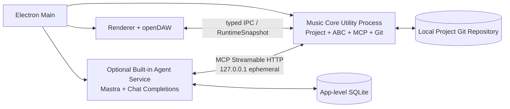

# Agent Music Workstation 系统架构文档

| 项目 | 内容 |
|---|---|
| 架构版本 | V1.2 |
| 需求基线 | Agent Music Workstation PRD V1.5 Consolidated Decisions |
| 状态 | P0 架构基线；技术 Gate 通过后冻结实现 |
| 日期 | 2026-07-29 |
| 首发平台 | Windows 10/11 |
| 核心技术 | Electron、React、TypeScript、openDAW、Mastra、MCP、Git/worktree、SQLite |

> 本版删除 Section 领域模型、版本化 Mapping、P0 稳定 Note/Event ID、P0 音色混音工具和完整 Scope Diff；增加 Canonical ABC 完全展开、P0 Scope Mapping、Canonical Scope、Task 级 checkpoint、localhost HTTP MCP 和精简项目事实文件。

---

## 1. 文档目的与范围

本文档定义 Agent Music Workstation P0 的：

- 系统和进程边界；
- Monorepo 与模块职责；
- Canonical ABC、Tick、Scope Mapping 和 openDAW 数据链路；
- Local MCP 的连接、工具和权限模型；
- Current、Candidate、Task 与 Git/worktree 状态机；
- 保存、恢复、试听、导出和安全策略；
- 技术 Gate 与测试边界。

本文档不重新定义产品需求；与 PRD V1.5 冲突时，以 PRD 为准。

---

## 2. 已确认架构决策

| 编号 | 主题 | 决策 |
|---|---|---|
| ADR-001 | 产品形态 | Electron 本地桌面应用，不开发独立 Web 端。 |
| ADR-002 | 桌面 UI | React + TypeScript，运行于 Electron Renderer。 |
| ADR-003 | 音乐工作区 | fork/内嵌 openDAW，P0 复用 Track、Clip、时间轴、Transport 和音频运行时。 |
| ADR-004 | Piano Roll | P0 不显示；后续用户音符编辑时再启用。 |
| ADR-005 | Agent Runtime | Mastra 承载单 Agent Loop、会话、计划和有限修复。 |
| ADR-006 | Agent 写入边界 | 所有 Agent 工程写入统一经过 Local MCP。 |
| ADR-007 | 编曲事实来源 | 单一 `composition.abc` 是编曲唯一事实来源。 |
| ADR-008 | Canonical ABC | 保存为完全展开形式，禁止 Repeat 简写。 |
| ADR-009 | Scope Mapping | P0 实现 Tick Range 到 ABC 字符范围映射；Mapping 是缓存，不进入 Git。 |
| ADR-010 | Scope | 内部只保留 `wholeProject` 或 `trackIds + [startTick,endTick)`。 |
| ADR-011 | Current | 创建项目时即产生空白 Current；Current 为 `main` HEAD。 |
| ADR-012 | Candidate | P0 单 Candidate，使用独立 branch + worktree。 |
| ADR-013 | Task checkpoint | 一个 Task 在 `finishTask` 成功后形成一个 Candidate checkpoint。 |
| ADR-014 | Accept | 将 Candidate 最终树 squash 为一个正式 Current commit。 |
| ADR-015 | 恢复 | 只保证最后成功 Current；P0 不恢复运行 Task 或 Candidate。 |
| ADR-016 | 轨道 | P0 固定六轨，不做动态轨道管理。 |
| ADR-017 | Section | P0 不存在 Section 领域模型或 UI 功能。 |
| ADR-018 | 时间 | P0 使用项目固定 PPQ=960 的整数 Tick，不静默量化。 |
| ADR-019 | 稳定 ID | P0 只持久化项目 ID 和固定 Track ID，不持久化 Note/MIDI/Runtime ID。 |
| ADR-020 | 音色权限 | P0 不开放 Agent 音色/效果器/混音工具；P1 增加。 |
| ADR-021 | 项目文件 | P0 Git 权威文件仅 `project.json` 与 `composition.abc`。 |
| ADR-022 | MCP 进程 | MCP Server 位于 Music Core Utility Process。 |
| ADR-023 | MCP Transport | 使用只监听 localhost 的 Streamable HTTP；P0 不实现 stdio Bridge。 |
| ADR-024 | Endpoint 发现 | 随机端口 + 用户运行时目录中的实例描述文件。 |
| ADR-025 | MCP 权限 | Instance Token 负责连接；服务器端 TaskContext 负责写入授权。 |
| ADR-026 | 模型协议 | P0 只支持 OpenAI-compatible Chat Completions。 |
| ADR-027 | 对话存储 | 应用级 SQLite 保存对话、Task 和执行记录，不作为工程事实。 |
| ADR-028 | 模型配置 | 用户级 `~/.agent-music/settings.json` 保存 Endpoint、API Key 和参数。 |
| ADR-029 | 试听 | Current/Candidate 各缓存 RuntimeSnapshot，只运行一个 openDAW Runtime。 |
| ADR-030 | 另存为 | 复制 Current 权威文件，生成新项目和新 Git 历史，不保留旧历史。 |

---

## 3. 架构目标与非目标

### 3.1 目标

- 空白工程与首次生成使用同一 Current → Candidate → Current 状态机；
- UI 连续时间选区可机械映射到 Canonical ABC 写入边界；
- Agent 不直接接触项目文件、Git 或 openDAW 对象；
- Current 始终稳定且可从 Git 恢复；
- Candidate 支持多个连续 Task，并按 Task 保存内部 checkpoint；
- ABC、MIDI、openDAW Runtime 和导出可以确定性重建；
- 两人 10–15 天内可实现，不为 P2 提前拆分复杂服务或数据模型。

### 3.2 非目标

P0 不实现：

- Section；
- 动态轨道；
- Piano Roll 和用户音符编辑；
- Agent 音色、效果器和混音编辑；
- 音频/MIDI 导入、录音和第三方插件；
- 多 Candidate、多 Agent、长期 Memory；
- 外部文件合并或采用；
- 复杂版本管理 UI；
- stdio MCP Bridge；
- Responses API。

---

## 4. 系统上下文与部署单元

### 4.1 Music Workstation

Music Workstation 是完整桌面部署单元，包括：

- Electron Main；
- Renderer / React UI；
- openDAW 工作区和播放 Runtime；
- Music Core Utility Process；
- Project Store、Candidate/Git、Scope Mapping；
- Local MCP Server。

Music Workstation 可以独立启动、打开、播放和导出项目，不要求 Agent Service 同时运行。

### 4.2 Built-in Agent Service

Built-in Agent Service 是可选独立进程，包括：

- Mastra；
- Chat Completions Provider Adapter；
- 对话与 Workflow；
- MCP Client。

内置 Agent 与未来外部 Agent 使用同一个 MCP Endpoint 和同一套工具，不存在私有写入路径。

### 4.3 物理进程拓扑



### 4.4 职责边界

#### Electron Main

- 应用和窗口生命周期；
- 启动、监督 Utility Process；
- 项目路径、文件选择和导出路径；
- 创建运行时描述文件；
- 不承载 ABC、Scope、Candidate 或 MCP 业务逻辑。

#### Renderer

- 六轨时间轴、Clip、Transport 和 Scope 选区；
- Agent 对话、确认、Current/Candidate 状态；
- 一个活动 openDAW Runtime；
- 不直接读写项目文件或 Git。

#### Music Core Utility Process

- 项目打开、校验、迁移和恢复；
- Canonical ABC Parser/Normalizer/Serializer；
- Scope Mapping；
- MIDI 编译和 openDAW Adapter；
- MCP Tool Host；
- TaskContext、Candidate 和 Git/worktree；
- 导出前重新编译与验证。

#### Agent Service

- Chat Completions 调用；
- 计划、工具循环、有限修复和取消；
- 通过 MCP 重新读取工程事实；
- 无项目目录、Git 或 openDAW 写权限。

---

## 5. Monorepo 与模块边界

采用紧凑型 pnpm Monorepo。逻辑模块不强制对应独立 npm package。

```text
agent-music-workstation/
├── apps/
│   ├── workstation/
│   │   └── src/
│   │       ├── main/
│   │       ├── renderer/
│   │       └── core/
│   │           ├── project/
│   │           ├── composition/
│   │           ├── scope-mapping/
│   │           ├── candidate/
│   │           ├── git/
│   │           ├── mcp/
│   │           ├── midi/
│   │           └── opendaw/
│   └── agent/
│       └── src/
│           ├── mastra/
│           ├── provider/
│           └── mcp-client/
├── packages/
│   └── contracts/
│       └── src/
│           ├── ipc/
│           ├── mcp/
│           └── schemas/
└── vendor/
    └── opendaw/
```

只有跨 Workstation 与 Agent 共享的 Schema 和类型进入 `packages/contracts`。

---

## 6. 项目文件与权威状态

### 6.1 项目目录

```text
project-root/
├── project.json
├── composition.abc
├── exports/                  # 默认不进入 Git
├── .agent-music/
│   ├── cache/
│   │   ├── current.mid
│   │   ├── candidate.mid
│   │   ├── scope-map/
│   │   └── render/
│   └── locks/
└── .git/
```

P0 不存在：

- `composition.map.json`；
- `metadata.json`；
- `sound-config.json`。

P1 音色和混音上线后增加 `sound-config.json`。

### 6.2 `project.json`

```ts
interface ProjectManifest {
  formatVersion: 1;
  projectId: string;
  timebase: {
    ppq: 960;
  };
  tracks: readonly [
    "track.drums",
    "track.bass",
    "track.guitar",
    "track.keys",
    "track.strings",
    "track.winds"
  ];
}
```

- 不保存 Current SHA；
- 不保存 Candidate ID；
- 不保存对话、Task、播放或 UI 状态；
- Git `main` HEAD 是唯一 Current 指针。

### 6.3 权威性优先级

1. `main` HEAD 对应的 Current 权威文件；
2. Candidate worktree 内的当前 Task 状态；
3. Canonical ABC 解析出的 AST、事件、MIDI、Scope Mapping 和 RuntimeSnapshot；
4. SQLite 中的对话和执行记录；
5. Renderer UI 和播放临时状态。

派生状态不能单独成为工程事实来源。

### 6.4 Current clean 规则

Current 主工作区必须保持 Git clean：

```text
git status --porcelain == ""
```

开始写 Task、Accept 和导出前检查。发现未提交修改时进入只读错误状态并要求恢复 `main` HEAD。

Candidate worktree 不执行 clean 或外部漂移检查，因为 Task 内允许存在合法未提交修改。

---

## 7. 音乐领域模型

### 7.1 固定 Track Registry

| 稳定 ID | 角色 |
|---|---|
| `track.drums` | 鼓 |
| `track.bass` | 贝斯 |
| `track.guitar` | 吉他 |
| `track.keys` | 钢琴/键盘 |
| `track.strings` | 弦乐 |
| `track.winds` | 管乐 |

领域层使用 `Track[]`，但 P0 校验数组必须恰好包含六个固定 ID、顺序和角色。

### 7.2 时间基准

P0 领域时间统一为整数 Tick：

```ts
type Tick = number;
const PROJECT_PPQ = 960;
```

规则：

- `project.json` 保存 `timebase.ppq`；
- Scope、Note、Tempo Event 和 Key Event 使用同一 Tick 时间轴；
- ABC 时值无法精确映射到项目 PPQ 时验证失败；
- 禁止静默量化；
- MIDI 与 openDAW 从相同 Tick 时间轴派生。

### 7.3 Meter、Tempo 与 Key

| 对象 | P0 模型 | 规则 |
|---|---|---|
| Meter | 单个 GlobalMeter | 可在 `wholeProject` 修改；不支持局部变拍。 |
| Tempo | TempoMap | 支持局部 Tempo Event。 |
| Key | KeyMap | 支持局部 Key Event 和已验证调式。 |

### 7.4 跨 Scope 事件

与局部 Scope 边界相交的既有持续事件是受保护对象。P0 不自动拆分跨边界 Note 或 Tie。

### 7.5 P0 稳定 ID

持久化：

- `projectId`；
- 固定 `trackId`。

不持久化：

- Note ID；
- Product Event ID；
- ABC AST Node ID；
- MIDI Event ID；
- openDAW Runtime Object ID；
- Scope Mapping Entry ID。

---

## 8. Canonical ABC

### 8.1 单文件六 Voice

`composition.abc` 包含一个 Tune 和六个固定 Voice。

```abc
X:1
M:4/4
L:1/8
Q:1/4=120
K:C

V:drums
...
V:bass
...
V:guitar
...
V:keys
...
V:strings
...
V:winds
...
```

全局拍号和初始音乐上下文只有一个事实来源。

### 8.2 Repeat 展开

Canonical ABC 禁止保存：

- `|: ... :|`；
- 第一/第二结尾；
- 跳转式反复；
- 其他导致源码片段对应多个播放位置的简写。

编曲进入 Candidate 前必须：

```text
parse
→ detect repeat
→ expand to played order
→ normalize
→ serialize Canonical ABC
```

### 8.3 Parser 使用边界

abcjs 等第三方库负责：

- ABC 解析；
- 事件时间计算；
- 源码字符位置；
- MIDI 或播放事件辅助生成。

Music Core 自身负责：

- Canonical ABC 规范；
- Repeat 展开策略；
- 持久化 Serializer；
- P0 支持语法白名单；
- 解析器版本兼容和缓存失效。

第三方库内部 Tune Object 不作为持久化领域模型。

---

## 9. Scope 与 Scope Mapping

### 9.1 Canonical Scope

```ts
type TaskScope =
  | {
      type: "wholeProject";
      trackIds: TrackId[];
    }
  | {
      type: "timeRange";
      trackIds: TrackId[];
      startTick: Tick;
      endTick: Tick;
    };
```

- 时间范围采用半开区间 `[startTick, endTick)`；
- 小节、Loop 和时间轴选区在 Renderer 转换为 Tick；
- 多轨选择共享同一个连续时间区间；
- 不支持多个离散时间区间；
- Agent 不接触 ABC 字符位置。

### 9.2 Scope Mapping Cache

```ts
interface ScopeMappingCache {
  sourceHash: string;
  parserVersion: string;
  ppq: number;
  tracks: Record<TrackId, ScopeMappingEntry[]>;
}

interface ScopeMappingEntry {
  startTick: Tick;
  endTick: Tick;
  abcSpans: Array<{
    startChar: number;
    endChar: number;
  }>;
}
```

同一连续时间 Scope 在多声部 ABC 中可以映射为多个字符 span，但产品层仍只有一个连续 Scope。

### 9.3 生成与失效

- 打开 Current 或 Candidate 时生成；
- 缓存与 ABC `sourceHash`、Parser Version 和 PPQ 绑定；
- `replaceScopedMusic` 前必须确认缓存有效；
- 修改 ABC 后重建受影响轨道的 Mapping；
- 缓存无法生成时禁止写入；
- Mapping 不进入 Git 或 Current Revision。

### 9.4 写入边界

`replaceScopedMusic` 不接受 `abcStart`、`abcEnd` 或完整工程文件。Music Core 根据 TaskContext Scope 计算允许替换的 span。

P0 不执行完整工程的事后 Scope Diff。安全性来自：

- 写工具只操作 Mapping 定位的 span；
- 临时副本原子替换；
- ABC 解析和编译；
- 固定六轨、全局拍号、事件边界和片段时长校验；
- 跨 Scope 事件只读保护。

---

## 10. MCP Server 与连接

### 10.1 部署位置

MCP Server 位于 Music Core Utility Process：

```text
Agent
→ MCP HTTP
→ Music Core Tool Host
→ TaskContext / Scope Mapping / Candidate / Git
```

Electron Main 只管理生命周期、端口和运行时描述文件，不转发具体工具调用。

### 10.2 Transport

P0 使用 MCP Streamable HTTP：

```text
http://127.0.0.1:<ephemeral-port>/mcp
```

- 只监听 `127.0.0.1`；
- 使用随机端口；
- P0 不实现 stdio Bridge；
- Music Workstation 可以先独立启动，Agent 后续连接。

### 10.3 Runtime Descriptor

Workstation 启动后写入用户运行时目录：

```json
{
  "projectId": "project-uuid",
  "endpoint": "http://127.0.0.1:43127/mcp",
  "instanceToken": "high-entropy-token",
  "pid": 12345
}
```

约束：

- 文件只允许当前用户读取；
- 不进入项目或 Git；
- 关闭项目后删除；
- 启动时清理 PID 已失效的描述文件；
- 支持多个项目实例使用不同端口。

### 10.4 权限模型

- `instanceToken` 只负责连接认证；
- 写工具必须携带 Host 创建的有效 `taskId`；
- Music Core 查询服务器端 TaskContext；
- Agent 不能自行创建 Task、Candidate 或 Scope；
- 连接 Token 不能绕过 Task Scope。

---

## 11. TaskContext 与 Agent 工作流

### 11.1 TaskContext

```ts
interface TaskContext {
  taskId: string;
  projectId: string;
  candidateId: string;
  baselineRevision: string;
  scope: TaskScope;
  scopeRevision: number;
  allowedOperations: string[];
  userIntent: string;
  planSummary?: string;
  modelConfigurationId: string;
  maxRepairAttempts: number;
  taskBaseCheckpoint: string;
  createdAt: string;
}
```

冻结字段：

- project、candidate、baseline；
- user intent 与模型配置；
- `maxRepairAttempts`；
- Task 起点 checkpoint。

可变字段：

- Scope 仅能在用户批准扩展后更新；
- 每次扩展 `scopeRevision + 1`。

### 11.2 Scope 扩展

```text
requestScopeExtension
→ Task 写入暂停
→ UI 显示新范围和原因
→ 用户批准
→ Music Core 扩展 TaskContext.scope
→ scopeRevision + 1
→ 同一 taskId 继续
```

### 11.3 修复

- `maxRepairAttempts` 来自用户级配置；
- Task 创建时冻结；
- 必须是有限非负整数；
- `finishTask` 验证失败后保留修改和 Editing 状态；
- Agent 可以继续修复并再次调用 `finishTask`；
- 达到上限后安全结束，不改变 Current。

---

## 12. P0 MCP Tool Registry

### 12.1 读取

#### `getTaskContext`

返回 Task、Candidate、Scope、固定六轨、音乐上下文和允许操作。

#### `getScopedComposition`

返回 Scope 内 Canonical ABC 和必要的前后只读上下文。Agent 不获得内部字符位置。

### 12.2 计划与授权

#### `submitGenerationPlan`

首次生成前提交工程计划。用户确认前写工具不可用。

#### `requestScopeExtension`

只提出扩展请求，不能直接修改 Scope。

### 12.3 写入

#### `replaceScopedMusic`

```ts
replaceScopedMusic({
  taskId,
  tracks: Array<{
    trackId,
    abc
  }>
})
```

内部流程：

```text
validate MCP session and TaskContext
→ validate scopeRevision and candidate state
→ load valid Scope Mapping
→ locate allowed ABC spans
→ parse submitted ABC fragment
→ reject or expand Repeat
→ validate fragment duration and protected boundaries
→ apply to temporary copy
→ normalize and compile
→ rebuild Mapping and Candidate RuntimeSnapshot
→ atomic replace Candidate files
```

局部 Task 的替换片段必须保持对应 Scope 的 Tick 长度。只有 `wholeProject` 可以改变整曲长度或全局拍号。

### 12.4 完成

#### `finishTask`

执行完整验证：

- Canonical ABC 可解析且无 Repeat；
- 六个固定 Voice 完整；
- 时间值可精确映射到 PPQ；
- Scope Mapping 可重建；
- MIDI 可生成；
- RuntimeSnapshot 可构建；
- Current 未被修改；
- Candidate 文件状态完整。

成功后创建一个 Candidate checkpoint。失败不提交，Task 保持 Editing。

### 12.5 不向 Agent 暴露

- Accept / Reject / Discard Candidate；
- Play / Pause / Preview Switch；
- Git、文件或导出路径；
- Track 结构修改；
- P0 Sound / Effect / Mix 工具。

P1 增加：

- `listSoundOptions`；
- `updateTrackSound`；
- `updateTrackMix`。

---

## 13. Candidate、Task 与 Git 状态机

### 13.1 分支和 worktree

```text
main                         # Current
candidate/<candidateId>      # P0 最多一个临时分支
worktrees/<candidateId>/     # 独立 Candidate 工作目录
```

### 13.2 Candidate 可承载多个 Task

```text
Current commit C0
→ Candidate branch from C0
→ Task T1 → checkpoint P1
→ Task T2 → checkpoint P2
→ Task T3 → checkpoint P3
→ Accept → squash final tree as Current C1
```

P1/P2/P3 不进入正式 Current 历史。

### 13.3 Task 事务

```text
Task start
→ record taskBaseCheckpoint
→ write call A: atomic apply
→ write call B: atomic apply
→ finishTask
```

规则：

- 单次工具调用失败只回滚该调用；
- 成功调用可以暂不 Git commit；
- `finishTask` 成功后一个 Task 生成一个 commit；
- `finishTask` 失败保留修改；
- 用户取消或放弃时 reset 到 `taskBaseCheckpoint`。

### 13.4 Accept

1. 确认没有未完成 Task；
2. 停止 Candidate 播放；
3. 检查 Current 工作区 Git clean；
4. 重新解析、编译和验证 Candidate 最终树；
5. 以一个正式 commit 写入 `main`；
6. Current RuntimeSnapshot 替换为 Candidate Snapshot；
7. 删除 Candidate worktree 和 branch；
8. 保留旧 Current Revision。

Accept 失败时 Current 不改变，Candidate 保留。

### 13.5 Reject 与恢复

- Reject 删除 Candidate branch/worktree；
- P0 启动时可清理残留 Candidate；
- 不尝试自动恢复运行中的 Task 或未接受 Candidate；
- 永远不能将残留 Candidate 自动覆盖到 Current。

---

## 14. 编译和 openDAW Adapter

### 14.1 编译链路

```text
composition.abc
→ parse + normalize
→ domain events on PPQ timeline
→ Standard MIDI Document
→ RuntimeSnapshot
→ active openDAW Runtime
```

```ts
compile(source: CanonicalAbc): {
  normalizedAbc: string;
  domainEvents: DomainEvent[];
  midiDocument: StandardMidiDocument;
  scopeMapping: ScopeMappingCache;
  runtimeSnapshot: RuntimeSnapshot;
  validationReport: ValidationReport;
}
```

### 14.2 Mapping 与运行时 ID

运行时可以临时建立：

```text
ABC parse event
↔ MIDI event
↔ openDAW object
```

该映射只服务播放、定位和调试，不进入 Git，不要求跨修改保持对象身份。

### 14.3 Current / Candidate 试听

内存中缓存：

- Current RuntimeSnapshot；
- Candidate RuntimeSnapshot。

只运行一个活动 openDAW Runtime：

```text
switch preview
→ stop transport
→ load selected snapshot
→ restore playhead by Tick when possible
```

不运行两套 AudioContext 或两套音频图。

---

## 15. 模型 Provider 与配置

### 15.1 Chat Completions

P0 Provider Adapter 只实现：

```text
POST /v1/chat/completions
```

支持：

- messages；
- tools / tool_choice；
- streaming；
- tool calls；
- cancellation；
- timeout；
- provider error mapping。

不实现 Responses API 双协议适配。

### 15.2 用户级配置

```text
%USERPROFILE%\.agent-music\settings.json
~/.agent-music/settings.json
```

```ts
interface Settings {
  formatVersion: 1;
  activeModelConfigId: string;
  modelConfigs: Array<{
    id: string;
    endpoint: string;
    apiKey: string;
    model: string;
    parameters?: Record<string, unknown>;
  }>;
  agent: {
    maxRepairAttempts: number;
  };
}
```

- API Key 为用户级本地明文配置；
- 文件权限限制为当前用户；
- 不进入项目、Git、SQLite 或日志；
- 使用临时文件 + 原子替换写入。

### 15.3 SQLite

应用级 SQLite 保存：

- projects；
- conversations；
- messages；
- tasks；
- tool_calls；
- validation_results。

复制项目目录不会自动复制旧对话或 Task 数据。

---

## 16. IPC 与事件

### 16.1 原则

- 跨进程消息使用共享 TypeScript Schema 和运行时验证；
- Command 包含 `requestId` 和幂等键；
- Event 包含 `projectId`、`taskId`、`candidateId` 和序列号；
- 大 MIDI 和 RuntimeSnapshot 使用 transferable buffer 或内部临时文件；
- Renderer 不获得任意文件路径访问。

### 16.2 主要方向

| 方向 | 命令/事件 |
|---|---|
| Renderer → Core | createScope、startTask、cancelTask、acceptCandidate、rejectCandidate、loadPreview、exportCurrent |
| Agent → MCP | getTaskContext、getScopedComposition、submitGenerationPlan、requestScopeExtension、replaceScopedMusic、finishTask |
| Core → Renderer | runtimeSnapshot、taskStageChanged、candidateChanged、validationResult、currentCommitted、error |
| Main → Services | openProject、closeProject、restartService、chooseExportPath |

### 16.3 Task 阶段

```text
planning
→ awaiting_confirmation
→ preparing_candidate
→ editing
→ compiling
→ validating
→ repairing
→ candidate_ready
→ accepting
→ committed | failed | cancelled | ignored
```

---

## 17. 保存、恢复和另存为

### 17.1 打开项目

1. 校验项目目录和 Git Repository；
2. 确认 Current 工作区 clean；
3. 读取 `main` HEAD；
4. 校验 `project.json` 与 `formatVersion`；
5. 读取 Canonical ABC；
6. 重建 Mapping、MIDI 和 RuntimeSnapshot；
7. 清理不保证恢复的旧 Task 锁和 Candidate 残留。

### 17.2 另存为

```text
source Current HEAD tree
→ copy project.json + composition.abc
→ generate new projectId
→ init new Git repository
→ commit Initial Current
```

不复制：

- 原 Git 历史；
- Candidate；
- SQLite 对话和 Task；
- 缓存；
- 导出文件。

---

## 18. 导出架构

### 18.1 原则

- 所有正式导出只读取 Current `main` HEAD；
- Candidate 不导出；
- 导出前重新编译和验证，不直接复用可能过期的缓存；
- 目标文件使用临时文件 + 原子 rename。

### 18.2 MIDI

保留：

- 六轨顺序；
- Tempo Map；
- 全局 Time Signature；
- Key Signature 可表达部分；
- Note Start、Duration、Pitch、Velocity；
- 完整长度和尾部休止。

### 18.3 ABC

导出 Current 的 Canonical `composition.abc`。

### 18.4 WAV

通过 openDAW Adapter 触发整曲离线渲染。技术 Gate 必须验证：

- 渲染 API；
- 进度；
- 取消；
- 尾音；
- 原子输出。

Gate 失败时 WAV 降为 P1。

---

## 19. 安全与隐私

### 19.1 Electron

- `nodeIntegration=false`；
- `contextIsolation=true`；
- 严格 preload allowlist；
- 禁止未授权导航和外部内容；
- Renderer 不获得 Node 文件系统权限。

### 19.2 MCP

- 只监听 loopback；
- Endpoint 使用随机端口和短生命周期 Token；
- 写工具不接受文件路径、Git 参数或 openDAW 指针；
- 所有写入检查 TaskContext 和 Candidate 状态。

### 19.3 日志

结构化日志可记录：

```text
taskId, projectId, candidateId, baselineRevision,
scopeRevision, toolName, validationCode,
repairAttempt, finalStatus, durationMs, modelConfigurationId
```

禁止记录：

- API Key；
- 完整 Authorization Header；
- 默认完整工程内容；
- 未脱敏 Provider 错误请求。

---

## 20. 并发与性能

- 同一项目一个 Agent 写 Task；
- 同一项目一个 Candidate；
- Music Core 使用项目级串行写队列；
- 读取可以并发；
- Git、ABC 编译和 WAV 渲染不运行于 Renderer 音频线程；
- 取消令牌传播到模型、MCP、编译和渲染；
- 优先保证 UI 可响应、Task 可取消和 Current 不损坏；
- Candidate 更新可按受影响轨道重建 Mapping，但结构、Meter、Tempo 或 Key 变化允许全量编译。

---

## 21. 测试与技术 Gate

### 21.1 单元与属性测试

- Canonical ABC Repeat 展开与规范化；
- ABC 时值到 PPQ=960 的精确映射；
- 固定六 Voice 不变量；
- Canonical Scope 包含关系；
- Scope Mapping 字符范围；
- 跨边界事件只读；
- 写工具原子性；
- TaskContext、scopeRevision 和迟到结果；
- `finishTask` 失败后的继续修复。

### 21.2 Contract 测试

- MCP Tool Schema 和错误码；
- HTTP Endpoint、Token 和运行时描述文件；
- IPC Command/Event；
- openDAW Adapter 输入输出；
- Chat Completions 的流式、Tool Call、取消和超时。

### 21.3 集成与故障注入

- Candidate branch/worktree 创建和删除；
- 多 Task checkpoint；
- Accept squash；
- Current clean 检查；
- 文件原子替换和 Git commit 阶段进程终止；
- Renderer、Core 和 Agent Service 分别崩溃；
- Windows 中文路径、长路径、Defender 和 stale lock；
- 打开最后 Current；
- 另存为不复制历史。

### 21.4 技术 Gate

| ID | 验证主题 | 通过内容 |
|---|---|---|
| TG-001 | Canonical ABC | Repeat 展开、规范化、自由曲长和六 Voice。 |
| TG-002 | Scope Mapping | Tick Range 唯一映射到受控 ABC span。 |
| TG-003 | ABC → MIDI → openDAW | 六轨、Tempo、Meter、Key 和事件长度。 |
| TG-004 | 跨边界事件 | 局部 Scope 边界相交事件只读。 |
| TG-005 | Git/worktree | Windows Candidate、多 Task checkpoint、Accept/Reject 和清理。 |
| TG-006 | Current 恢复 | 只依赖 clean `main` HEAD 恢复。 |
| TG-007 | MCP HTTP | localhost、随机端口、Token 和多实例描述文件。 |
| TG-008 | Chat Completions | Tool Call、流式、取消和错误映射。 |
| TG-009 | MIDI 导出 | 保留核心工程数据。 |
| TG-010 | WAV | 离线渲染、进度、取消、尾音和原子输出。 |

---

## 22. 主要风险与缓解

| 风险 | 影响 | 缓解 |
|---|---|---|
| ABC Repeat 与播放时间一对多 | Scope 写入边界不唯一 | Canonical ABC 强制完全展开。 |
| abcjs 内部对象不稳定 | 持久化格式被第三方版本绑定 | 只使用解析结果，持久化由自有 Normalizer/Serializer 管理。 |
| Scope Mapping 错误 | Agent 越界修改 | Hash 绑定、写前重建、边界夹具和属性测试。 |
| 固定 PPQ 无法表示某些时值 | 编曲无法无损编译 | 明确拒绝，不静默量化；Gate 验证支持语法范围。 |
| openDAW API 不稳定 | 试听或 WAV 受阻 | 强制 Adapter，早期技术 Gate。 |
| Windows worktree 残留 | 无法打开项目或磁盘污染 | 独立内部目录、stale lock、启动清理和故障注入。 |
| Current 被外部修改 | Current 不再等于 Git HEAD | 强制 clean 检查，P0 不合并外部修改。 |
| Candidate Task 中间状态损坏 | 无法继续修复 | 单次写入原子替换，Task 起点 checkpoint。 |
| API Key 明文配置 | 本机其他用户读取风险 | 用户级目录、严格文件权限、日志脱敏。 |

---

## 23. 架构不变量

1. 创建项目时必须产生空白 Current Git Revision。
2. Current 等于 `main` HEAD，不在 `project.json` 保存重复指针。
3. Current 主工作区必须 Git clean。
4. Agent 永远不能直接写 Current、项目文件、Git 或 openDAW 对象。
5. 所有 Agent 写操作必须经过 Local MCP、TaskContext、Scope Mapping 和 Candidate 校验。
6. P0 Scope 只有 `wholeProject` 或固定轨道集合上的连续 Tick 范围。
7. 自然语言不能重新计算 Scope。
8. Scope 扩展必须由用户批准，并增加 `scopeRevision`。
9. P0 不支持多个不连续时间范围。
10. P0 固定六轨，不存在 Section。
11. `composition.abc` 是唯一编曲事实来源。
12. Canonical ABC 必须完全展开，不含 Repeat 简写。
13. Scope Mapping 是可重建缓存，不进入 Git。
14. P0 不持久化 Note/MIDI/Runtime ID。
15. 一个 Candidate 可以连续承载多个 Task。
16. 一个成功 Task 形成一个 Candidate checkpoint。
17. `finishTask` 失败保留修改并允许继续修复。
18. Accept 将 Candidate 最终树 squash 为一个新 Current Revision。
19. P0 只保证恢复最后成功 Current。
20. Candidate 不允许正式导出。
21. P0 Agent 不修改音色、效果器和混音。
22. P0 项目 Git 权威文件只有 `project.json` 和 `composition.abc`。
23. 应用级 SQLite、RuntimeSnapshot、MIDI 缓存和 Agent 对话不能成为工程事实。
24. API Key 不进入项目、Git、SQLite 或日志。
25. 另存为不保留原项目 Git 历史。
