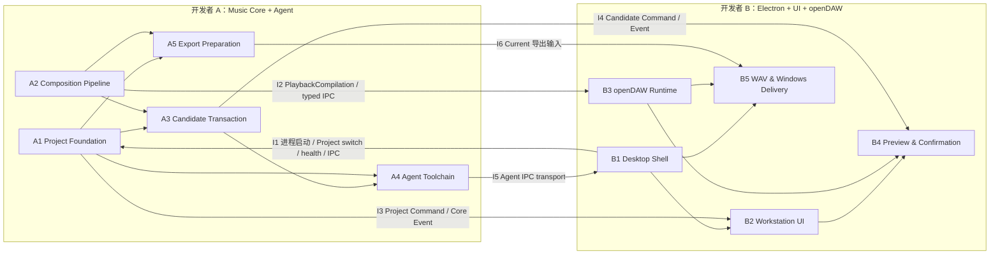

# Agent Music Workstation P0 十天双人模块化开发计划

**版本：** 2.0

> **For agentic workers:** REQUIRED SUB-SKILL: Use superpowers:subagent-driven-development or superpowers:executing-plans to implement this plan task-by-task.

**目标：** 在 10 个开发日、2 名开发者条件下，基于现有 pnpm Monorepo 骨架交付 Agent Music Workstation P0。

**分工推导原则：** 先遵循仓库已确定的系统架构、进程拓扑和模块依赖，再将高内聚模块簇分配给两名开发者。人员分工不得反向修改架构或引入新的实现边界。

**最终分工：**

- 开发者 A：Music Core Utility Process + Built-in Agent Service。
- 开发者 B：Electron Main + Renderer/React UI + openDAW Runtime。

**技术基线：** Node.js 24.18.1、pnpm 9.15.9、TypeScript、Electron、React、openDAW、Strands、MCP、abcjs、Git/worktree。

---

## 1. 权威基线

开发必须遵循：

- `docs/product/Agent Music Workstation PRD.md` V1.17；
- `docs/architecture/Agent Music Workstation System Architecture.md` V1.15；
- `docs/architecture/spike.md` 中 Spike-001～010 的技术结论；Spike-010 的 Velocity 候选已按 ADR-034 纳入 P0。

TG-001～TG-010 已完成既有技术可行性验证。开发阶段将其行为结论固化为正式模块和回归测试；其中 TG-008 的自研 Provider Adapter 实现约束已由 Architecture V1.15 ADR-044 替代，A4 应以 Strands 原生 Chat Completions / MCP Client 集成为正式实现，并复用 TG-008 的 Tool Call、流式、取消和错误行为作为回归标准。

本计划只定义：

- 谁负责哪些现有架构模块；
- 两人如何并行；
- 每日交付和集成 Gate；
- 代码所有权与协作规则。

本计划不修改：

- Electron Main、Renderer、Music Core Utility Process 和 Agent Service 的进程拓扑；
- Renderer ↔ Core 的 typed IPC / PlaybackCompilation 通信；
- Agent ↔ Core 的 MCP Streamable HTTP 通信；
- MCP Server 的部署位置和九个 P0 Tool；正式桌面产品为单 Core/单 MCP/`0..1` Active Project，Project 切换不重启 MCP；
- Canonical ABC → MIDI → openDAW Runtime 的链路；
- Current、Candidate、Task checkpoint 和 Git/worktree 状态机；
- ABC、MIDI、WAV 的既定导出链；
- PRD 已冻结的产品范围。

---

## 2. 由架构反推的模块簇

现有物理进程拓扑为：

```text
Electron Main
├── Renderer + React UI + openDAW
├── Music Core Utility Process（长期存活，0..1 Active Project + one MCP）
└── Built-in Agent Service（one Core MCP connection）

Renderer ↔ Music Core：typed IPC / PlaybackCompilation + TimelineViewModel
Renderer ↔ Agent Service：经 Electron Main / Preload 的 typed Agent transport bridge（Session lifecycle + text/terminal）
Agent Service ↔ Music Core：Strands MCP Client + MCP Streamable HTTP
Agent Service ↔ Strands Session Storage
Music Core ↔ Project Git Repository
```

由此形成两个高内聚模块簇。

### 2.1 模块簇 A：工程事实与 Agent 执行

包含：

```text
Music Core Utility Process
├── Project Store
├── Canonical ABC
├── Scope Mapping
├── MIDI Compilation
├── Candidate / Task / Git
├── MCP Server
├── Export 数据准备与 Current 校验
└── Core IPC Handler

Built-in Agent Service
├── Strands Agent Loop
├── Strands OpenAI-compatible Chat Completions
├── Strands Agent-side MCP Client
├── Strands SessionManager / Storage
├── Agent Workflow
├── Agent / Model Settings
└── assistant text stream / execution terminal transport
```

该模块簇共同处理：音乐工程事实、Agent 授权、工具调用、Candidate 写入和任务状态。

因此分配给开发者 A。

### 2.2 模块簇 B：桌面交互与音频运行时

包含：

```text
Electron Main
├── BrowserWindow / Preload
├── Process Supervisor
├── File / Directory Dialog
├── openDAW Resource Paths
└── Windows Build

Renderer
├── React Product UI
├── Six-track Workspace
├── Product Time Selection
├── Current / Candidate Controls
└── Agent Conversation Presentation

openDAW Runtime
├── SDK Adapter
├── WASM / Worker / AudioWorklet
├── RuntimeSnapshot Load
├── Transport / Preview
└── Offline WAV Render
```

UI、时间轴、Clip、播放头、Transport 和 openDAW SDK 共享同一 Renderer 运行环境并频繁协同，因此作为一个模块簇分配给开发者 B。

### 2.3 三条既有集成 seam

两人只沿架构已经存在的 seam 集成：

1. **Renderer ↔ Music Core：** typed IPC、PlaybackCompilation、TimelineViewModel、Command/Event；
2. **Agent ↔ Music Core：** MCP Streamable HTTP；
3. **Renderer ↔ Agent Service：** 经 Main/Preload 的 typed text transport，只承载用户消息/Cancel、assistant text delta 与 execution terminal event。

由于 Agent 和 Music Core 都由 A 负责，开发者 A 仍必须保持 MCP 隔离：内置 Agent 不得直接调用 Core 内部类、写文件或执行 Git。Agent UI transport 也不得承载原始 MCP Tool Result、A4 Workflow state 或任何工程写入/授权语义。

---

## 3. 开发者 A 的责任

### 3.1 Music Core Utility Process

A 负责：

- 项目目录、项目元数据与 Current Git 的创建、打开、显式恢复和另存为；
- 进程内项目写入串行化与不同应用实例打开同一项目的写锁；
- `project.json`、`composition.abc` 和 clean `main` HEAD；
- Git、Candidate branch/worktree、Task checkpoint；
- Canonical ABC 解析、Repeat 展开、规范化和序列化；
- 固定六 Voice、PPQ=960、P0 语法白名单和每事件 Velocity `1..127`；Velocity `0` 必须在进入领域事件前拒绝；
- Scope Mapping、`scopeRevision`、跨边界事件保护；
- Scope 与 Composition length 解耦；`resizeComposition(targetMeasureCount)` 负责尾部结构 resize，`requestScopeExtension` 只负责授权；
- `TRACK_LENGTH_MISMATCH` 轨长明细、ABC parser warning 去 HTML/聚合/限量、tick-0 inline Tempo/Key 拒绝；
- `replaceScopedMusic`、`updateMusicalProperties` 与 `resizeComposition` 原子事务；
- ABC → Standard MIDI Document；
- 单一 MCP Server、Instance Token、Core-process-scoped runtime descriptor；MCP 与 Core 同生命周期，Project close/open 不重启；
- 九个 P0 MCP Tool 的 Schema、授权和业务语义；
- `finishTask`、Accept、Reject、取消和迟到结果保护；
- Current-only 导出前检查、重新读取和重新编译；
- ABC/MIDI 导出数据；
- Core 侧 IPC Handler 和 Event；
- Music Core 单元、Contract、Git 和故障注入测试。

### 3.2 Built-in Agent Service

A 负责：

- Agent Service 进程入口和 typed `ready` / `health` / `shutdown` / `fatal` 生命周期；
- Strands 单 Agent Loop；
- 使用 Strands 原生 OpenAI-compatible Chat Completions 能力，不自研 SSE Tool Call 拼接或第二套 Provider 协议层；
- 使用 Strands 原生 Agent-side MCP Client，通过 Core-process-scoped descriptor + Instance Token 连接单一 Core MCP Server；A4 不按 `projectId` 选择多个 MCP Endpoint；
- Provider/MCP transient retry 优先使用 Strands/底层 Client；A4 只处理最终错误归一化，不实现第二层通用 retry loop；
- 首次生成计划，以及长时间挂起 `submitGenerationPlan` 等待 UI 用户确认的 A4 Workflow；Agent-facing 计划输入不携带 `projectId`，由 MCP Host 注入当前 Active Project；MCP timeout/cancel 必须传播到原 Tool Call；
- executing 阶段 Scope 扩展请求；repairing 阶段禁止 Scope Extension；Scope Extension confirmation 继承 MCP cancellation，timeout/cancel 后不得后台批准；
- `finishTask` validation failure 后的有限 repair：一轮 validation→repair→finishTask 计一次 `repairAttempt`，每轮开始前读取最新 `maxRepairAttempts`；
- 统一 Cancel：pre-Task 只终止 Workflow，已有 Active Task 时 `cancelTask` 并回滚；最终 execution failure 同样不得遗留 Active Task；
- 模型配置每次 Strands model call 动态读取，不冻结 Workflow/Task model snapshot；
- Agent / Model Settings 和 API Key 文件；
- Strands SessionManager/Storage 的 Project 多 Session 集成：一个 Project 可关联多个 Session，A4 负责 list/create/open/getActive 与唯一 Active Session 选择；P0 不支持多 Session 后台并行 execution，不自研 transcript/compaction，不使用 SQLite；
- Session lifecycle + assistant text stream + execution terminal event transport；原始 MCP Tool Result、Strands Storage 和 A4 Workflow state 不进入 Renderer transport；
- Agent Service 受控 fatal/shutdown 时由 A4 对 Active Task 触发 cancel + rollback；非受控子进程退出由 B1 supervisor 通知 Core/A3 执行 Project-only Active Task reconciliation；Session 只恢复对话；
- Agent 结构化日志和脱敏。

### 3.3 A 不负责

- React 页面和产品交互；
- BrowserWindow、Preload 和桌面打包；
- 直接使用 openDAW SDK；
- openDAW Worker、WASM、AudioWorklet 或 SoundFont；
- Transport、试听切换和 WAV Offline Renderer；
- UI 中的导出进度、确认弹层和错误呈现。

---

## 4. 开发者 B 的责任

### 4.1 Electron Main

B 负责：

- Electron Main、BrowserWindow 和应用生命周期；
- `nodeIntegration=false`、`contextIsolation=true` 和 Preload allowlist；
- 启动、监督和关闭 Core Utility Process 与 Agent Process；
- 进程 health、fatal error 和 restart 行为；通过共享 Agent Process Contract 转发 `ready` / `health` / `shutdown` / `fatal`，不解释 A4 业务状态；Agent 子进程非受控退出时向 Core 发送 `candidate.cancelActiveTaskForAgentLoss(projectId)`；
- A4 Agent Service ↔ Renderer 的 typed Agent transport bridge；Main/Preload 只转发最小 Session lifecycle、用户消息/Cancel、assistant text delta 与 execution terminal event，不拥有 Session/Agent Workflow 状态；
- 项目目录和导出路径选择；Project 切换确认后编排 `cancelCurrentExecution(currentProjectId)` → 等待 rollback/settle → Core close/open；切换不重启 Core/MCP；
- openDAW 资源路径；
- Windows 开发运行和发布构建。

B 只负责进程的启动与监督，不修改 A 所负责进程的内部业务。

### 4.2 Renderer / React UI

B 负责：

- React 应用壳和整体界面布局；
- 单窗口 Project 打开/切换 UI；当前存在 Agent execution/Active Task 时必须提示“切换将取消当前 Agent 操作”，确认后才进入 B1 cancel/rollback barrier，拒绝则保持当前 Project；
- 固定六轨工作区、Clip、时间轴和播放头；
- Product Time Selection；
- 单轨/多轨连续 Scope 的 UI 表达；
- Play、Pause、Seek、Loop、Solo、Mute 控件；
- Current/Candidate Preview 和状态显示；
- Renderer-side `AgentClient`，经 Main/Preload bridge 列出/创建/打开 Project Session、读取 Active Session、发送用户消息/Cancel，并消费 assistant text delta 与 execution terminal event；普通局部修改确认后，`sendMessage` 只附带 A3 已创建 Task 的最小 `{taskId, candidateId}` bootstrap，不复制 Scope/baseRevision/scopeRevision；
- Agent 面板只提供最小的新建 Session / 切换已有 Session 交互，不实现 rename、search、pin、folder 等复杂会话管理；
- Agent 对话与流式输出；A4 内部 Workflow state 和原始 MCP Tool Result 不进入 UI Contract；
- 首次生成、wholeProject、Scope 扩展和 Accept 的确认流程；
- Accept、Reject 和取消操作；
- 导出入口、进度、取消和用户错误提示；
- UI Store 和 Core Event 消费。

### 4.3 openDAW Runtime

B 负责所有直接依赖 `@opendaw/studio-sdk` 的实现，无论对应文件最终位于 Renderer 目录还是架构指定的 Adapter 目录：

- Standard MIDI Document 与音乐元数据到 openDAW Project / RuntimeSnapshot 的适配；
- 固定六轨 AudioUnit、Track、Region 和 NoteEvent；
- 产品 Track ID 与 openDAW UUID 的运行时映射；
- Tempo、Meter 和 Key wrapper；
- WASM、Worker、AudioWorklet、Sample 和 SoundFont；
- `soundfont2` ESM shim；
- RuntimeSnapshot load/reload/dispose；Project 切换时先停止并释放旧 Project 播放状态，新 Project 打开后再构建/加载 Snapshot；
- Current/Candidate 试听切换；
- openDAW Transport；
- Offline WAV Render、进度、AbortSignal 和尾音；
- openDAW 相关 Contract 和 Electron 集成测试。

### 4.4 WAV 功能归属

WAV 是跨模块流程，但功能负责人为 B，因为实际渲染依赖 Electron Renderer 中的 openDAW Runtime。

既有架构职责保持不变：

```text
A：检查只导出 clean Current，重新读取并编译工程，准备既定导出输入
B：选择输出路径，调用 openDAW Offline Renderer，显示进度并处理取消
```

这里是同一既有导出链上的任务分配，不是新的实现设计。

### 4.5 B 不负责

- Canonical ABC 语义和 Scope Mapping；
- Git、Candidate、Task checkpoint；
- MCP Tool 的业务规则；
- Agent Loop 和 Provider 协议；
- 直接修改 `project.json` 或 `composition.abc`；
- 直接操作 Current/Candidate Git 状态。

---

## 5. 共享代码和所有权规则

### 5.1 `packages/contracts`

共享 Contracts 由双方在 Day 1 按架构共同确认，不重新发明接口。

按领域设置主维护人：

| Contracts 范围 | 主维护人 | 必须 Review |
|---|---|---|
| Project、Task、Scope、MCP、Provider | A | B |
| IPC、PlaybackCompilation、RuntimeSnapshot、Renderer Event | B | A |
| Domain Track/Tick、错误码 | 共同 | 双方 |

Day 2 后：

- 禁止无迁移方案地重命名字段；
- 新增字段优先保持兼容；
- Contracts 修改使用独立 commit；
- 另一名开发者 review 后合并；
- 不通过未声明字段或 `unknown` payload 绕过 Contracts。

### 5.2 目录不等于人员边界

人员所有权以架构模块为准，不机械按目录划分。

例如架构如果将 openDAW Adapter 放在：

```text
apps/workstation/src/core/opendaw/
```

该目录仍由 B 负责，因为它属于 openDAW SDK 模块。A 负责调用该 Adapter 的 Music Core 逻辑。

### 5.3 Lockfile

- 双方各自在功能 commit 中修改所属 workspace 的依赖；
- `pnpm-lock.yaml` 只在固定集成窗口合并一次；
- 禁止双方把大量无关依赖升级混入功能提交；
- Node 固定为 24.18.1，pnpm 固定为 9.15.9。

---

## 6. 并行开发方式

### 6.1 A 的独立测试输入

A 在 B 未完成 Renderer/openDAW 前使用：

- Spike 中的 Canonical ABC fixtures；
- 固定 PlaybackCompilation/Adapter Contract fixture；
- Fake Core Event consumer；
- 本地 fake Chat Completions Provider；
- 真实 MCP Server/Client；
- 临时 Git 项目。

A 不需要等待完整 React UI 才能完成 Project、ABC、Scope、Git、MCP 和 Agent。

### 6.2 B 的独立测试输入

B 在 A 未完成真实 Core 前使用：

- Spike 中已验证的六轨 RuntimeSnapshot fixture；
- Fake typed IPC Core Client；
- 固定 Project/Candidate/Task 状态；
- 固定确认请求和结构化错误；
- 模拟导出进度和取消；
- 固定 Agent 用户消息、assistant text delta 和 execution terminal event。

B 不需要等待 Agent 和 Git 状态机才可完成 Electron、UI 和 openDAW。

### 6.3 集成原则

集成由模块依赖触发，不以“当天必须联调某个子功能”为依据：

- 模块内部由负责人自行安排实现顺序；
- 上游模块达到稳定输出后，才进入对应的跨模块 Checkpoint；
- Checkpoint 之前使用 Spike fixture、Fake IPC 或 Fake Provider，不等待对方内部实现；
- Checkpoint 失败时只修复该 seam 两侧的问题，不扩散为跨模块重构；
- 目标日期是最晚完成窗口，不限制模块提前完成或调整内部顺序；
- Day 10 不再接收新模块，只处理验收阻塞。

---

## 7. 模块编号与交付包

模块是计划中的最小管理单元。模块内部由负责人自行安排实现顺序；计划只约束模块职责、依赖、稳定输出和联调点。

### 7.1 开发者 A：Music Core + Agent

| 编号 | 模块 | 主要范围 | 直接依赖 | 稳定输出 |
|---|---|---|---|---|
| **A1** | Project Foundation | 项目目录/元数据与 Current Git 创建、打开、关闭、显式恢复、另存为；一个长期 Core 内同时 `0..1` Active Project；进程内项目写入串行化；跨实例项目写锁；Project IPC Handler | Contracts | clean Current 项目生命周期；可在同一 Core 内安全 close/open 不同 Project；同项目单写实例；稳定 Project Command/Event |
| **A2** | Composition Pipeline | Canonical ABC、Scope Mapping、PPQ、领域事件、每事件 Velocity、Global Musical Properties（初始 Meter / Tempo）、Composition Resize 与最终 Meter/barline 一致性校验、Standard MIDI Document、PlaybackCompilation 与 TimelineViewModel；不依赖 openDAW SDK，不构建 RuntimeSnapshot | Contracts、Spike fixtures | Canonical ABC、ScopeMappingCache、`replaceScopedMusic`、`updateMusicalProperties`、`resizeComposition`、`validateFinalMeterConsistency`、PlaybackCompilation、TimelineViewModel、ValidationReport |
| **A3** | Candidate Transaction | Candidate `baseRevision`、`.agent-music` worktree、Candidate/Task 双状态机、execution envelope、Scope Extension 授权、checkpoint、Accept/Reject、取消回滚、cleanup marker、稳定领域错误；Current 正式写入经 A1 串行写入机制；Project close 前 Active Task 必须已取消/回滚 | A1、A2 | 不修改既有 Current 的 Candidate 事务；稳定 cancel/rollback 与 Agent-facing / Renderer-control interface；Project switch 可用权威 Task 状态 fail-closed |
| **A4** | Agent Toolchain | Strands Agent Loop、OpenAI-compatible Chat Completions、Agent-side MCP Client、Project 多 Session/SessionManager/Storage、Core-process-scoped descriptor、Agent / Model Settings、planning/confirmation、统一 Cancel/final-failure rollback、有限 repair、Agent transport | A1、A3、MCP/Agent Contracts | 一个 Project 可有多个 Session 但同时唯一 Active Session；Agent Service 对单一 Core MCP 保持一个基础设施连接，不按 Project 切 Endpoint；Project switch 时 Cancel Promise 在 Active Task rollback 后才完成；Renderer 仅通过最小 Session lifecycle + 文本流/终态访问 A4 |
| **A5** | Export Preparation | 复用 A1 clean Current 读取校验、A2 重新编译，准备 ABC/MIDI 导出数据与 WAV 输入；不拥有 Agent Settings、Session 或历史数据库 | A1、A2 | 经过 Current 校验的 ABC/MIDI/WAV 导出输入 |

#### 7.1.1 A1 最小接口与实现边界

A1 对 Renderer/Core IPC 只暴露与项目生命周期需求直接对应的接口：

```ts
interface ProjectFoundation {
  createProject(projectPath: string): Promise<OpenedProject>;
  openProject(projectPath: string): Promise<OpenedProject>;
  recoverCurrent(): Promise<OpenedProject>;
  saveProjectAs(targetPath: string): Promise<OpenedProject>;
  closeProject(): Promise<void>;
}
```

A1 内部必须保留：

```ts
createInitialComposition(): string;
```

该方法由 `createProject()` 调用，不进入 Renderer IPC。A1 阶段允许使用明确的 TODO 或固定 fixture 占位；A2 负责补齐 Canonical ABC 的正式生成语义。

A1 还向 Core 内部提供项目级串行写入、clean Current 读取与当前项目路径查询能力：

```ts
interface ProjectAuthorityAccess {
  readCleanCurrent(): Promise<CurrentAuthoritySnapshot>;
  getProjectPath(): string;
  runSerializedWrite<T>(operation: () => Promise<T>): Promise<T>;
}
```

`getProjectPath()` 只供 Core 内部 A3 定位 Candidate linked worktree；不得向 Renderer 或 Agent 暴露。A3 的 Accept 复用 A1 serialized write，A5 复用 clean Current 读取；不得向 A3 暴露 A1 的 GitAdapter、锁对象或解锁能力。

A1 验收至少覆盖：

- 创建项目目录、`project.json`、`composition.abc`、Git `main` 和 Initial Current commit；
- 打开、关闭、显式恢复和另存为；
- 同一进程内项目写操作严格串行；
- 第二个应用实例不能同时获得同一项目的写锁；正常关闭释放锁，崩溃残留锁可安全识别；
- dirty Current fail-closed，恢复只读取 `main` HEAD；
- A3/A5 使用 A1 的锁和 Current guard，不重复实现 Git clean 规则。

#### 7.1.2 A3 Candidate Transaction 边界

A3 是 Candidate/Task 业务事务的唯一 owner，A4 与 Renderer 只通过角色化 interface 使用它：

```text
A4 / MCP adapter
→ A3 Agent-facing interface
→ A2 CompositionPipeline + Candidate transaction

Renderer/Core control
→ A3 control interface
→ start/cancel/scope approval/accept/reject
```

A3 必须实现：

- Candidate 创建时冻结 `baseRevision=main HEAD`；一个 Candidate 对应 `candidate/<candidateId>` + `.agent-music/worktrees/<candidateId>/`；Ready Candidate 的后续 Task 复用同一 worktree；
- 正式 Task 只在用户确认后创建；A3 只保留一个 Active Task，TaskContext 不保存 userIntent、模型配置或 repair policy；
- Task-bound MCP execution envelope 统一校验 `taskId/projectId/candidateId/baseRevision/expectedScopeRevision`；ID 全局唯一；
- Scope Extension 只能扩大，A3 独占 `scope/scopeRevision` 写权限，Pending request 形成写入 barrier；
- `allowedOperations` 从 Scope 与 P0 capability 实时推导，不持久化；
- 普通 Candidate mutation 不排队；busy 返回 `TASK_BUSY`。Cancel/Reject 先失效授权，运行中的 mutation 在落盘前必须复检；
- `finishTask` 同时执行 A3 事务校验与 A2 final validation；成功只 checkpoint `composition.abc`，使用 `--allow-empty`；
- `project.json` 必须保持 Candidate baseRevision 版本；其他非忽略意外 Candidate 文件变化 fail-closed；
- Cancel 回滚当前 Task；首 Task cancel 且无成功 checkpoint 时结束空 Candidate；Reject 可在 Active Task 中强终止整个 Candidate；
- baseline 漂移后 Candidate 进入 `stale`，只能 Reject；
- Accept 的成功点为新 `main` commit 成功；commit 前失败恢复旧 Current 并保留 Candidate，commit 后 cleanup 失败不回滚；
- Reject 的成功点为 Candidate 授权失效；Accept/Reject cleanup 失败均进入独立 PendingCleanup，不阻塞新 Active Candidate；
- 自动清理只处理存在 `.agent-music/candidate-cleanup/<candidateId>.json` marker 的资源；无 marker orphan 只报告；
- 对外只暴露稳定 Candidate Command/Event 与领域错误码，不暴露 branch、worktree、checkpoint SHA、cleanup 路径和底层异常文本。

### 7.2 开发者 B：Electron + UI + openDAW

| 编号 | 模块 | 主要范围 | 直接依赖 | 稳定输出 |
|---|---|---|---|---|
| **B1** | Desktop Shell | Electron Main、Preload、一个 Core/Agent 进程监督、Agent transport bridge、路径选择、Project switch 生命周期编排、openDAW 资源路径 | IPC/Agent Contracts | Core/MCP 跨 Project 切换长期存活；确认后执行 Agent Cancel/rollback barrier，再安全 Core close/open；为 A4 ↔ Renderer 转发最小 Session lifecycle + text/terminal transport |
| **B2** | Workstation UI | 六轨工作区、时间轴、Scope、单窗口 Project 打开/切换 UI、Renderer-side AgentClient、Agent Session 新建/切换、Agent 对话流、Agent 面板、错误呈现 | B1、Fake Core/Agent Client | 可消费 Project/Task/Candidate 产品状态；运行中 Agent 操作/Active Task 时切 Project 必须先提示；拒绝保持原 Project，确认后委托 B1 执行 cancel/rollback + close/open |
| **B3** | openDAW Runtime | SDK Adapter；消费 A2 PlaybackCompilation 构建 RuntimeSnapshot；六轨 Runtime、资源加载、Transport、Snapshot load；Project switch playback teardown/reload | PlaybackCompilation、RuntimeSnapshot Contracts、Spike fixtures | 可从正式编译结果构建、加载 Snapshot 并稳定播放；Project 切换不泄漏旧 Transport/Runtime 状态 |
| **B4** | Preview & Confirmation | Current/Candidate 试听、generation plan/wholeProject/Scope Extension/Accept 与运行中任务 Project-switch 警告等确认流程、Accept/Reject UI、Core Event 消费 | B2、B3、A3 的稳定输出 | 完整 Candidate 预览和确认交互；Project-switch 确认只授权 B1 启动 Cancel/close/open 流程，不直接改变 A3 状态 |
| **B5** | WAV & Windows Delivery | Offline Render、进度、取消、尾音、桌面文件输出、Windows 构建 | B1、B3、A5 的稳定输出 | 可从 Current 导出 WAV 的 Windows 可运行构建 |

### 7.3 模块完成条件

模块只有同时满足以下条件才视为完成：

- 主要职责已实现，不把核心逻辑留给其他模块补齐；
- 稳定输出已通过 Contracts 或架构既有 seam 暴露；
- 模块测试和对应 Spike 回归通过；
- 下游可以使用真实输出或固定 fixture 消费该模块；
- 负责人提交可独立 review 和回滚的模块 commit。

---

## 8. 模块依赖关系图



### 8.1 依赖说明

| 依赖 | 上游必须稳定的输出 | 下游可开始的工作 |
|---|---|---|
| A1 → A3 | Current Git、跨实例写锁、项目级串行写入和 Project Command/Event | Candidate branch/worktree、事务状态机及安全 Accept |
| A2 → A3 | Canonical ABC、Scope Mapping、领域事件、MIDI、TimelineViewModel、ValidationReport | `replaceScopedMusic`、`updateMusicalProperties`、`resizeComposition` 和 `finishTask` 完整验证 |
| A1/A3 → A4 | A1 的 Active Project 生命周期，A3 的 TaskContext、Candidate 和八个 Tool 业务状态 | 单一 Core MCP connection、Strands Tool Loop 与 Agent Workflow；`projectId` 只用于业务/授权校验，不用于 Endpoint 选择 |
| A1/A2 → A5 | A1 的 clean Current 读取校验、A2 的重新编译能力 | 正式 ABC/MIDI/WAV 导出准备 |
| A4 → B1 → B2 | A4 最小 Session lifecycle + text/terminal Contract；B1 安全 Main/Preload transport | Renderer-side AgentClient、Project Session 新建/切换、用户消息/Cancel、assistant 流式文本与 execution 终态 |
| B1 → B2 | 安全 Preload 和 typed IPC Client | 真实桌面 UI |
| B2/B3 → B4 | 产品交互状态和可播放 Runtime | Current/Candidate 预览及确认流程 |
| B1/B3 → B5 | 文件路径、资源环境和 Offline Renderer | WAV 与 Windows 交付 |

跨开发者依赖只使用图中 `I1～I6` 所标注的架构既有接口，不新增进程、私有调用或替代数据格式。

---

## 9. 十天时间窗口

时间窗口约束模块完成和联调点，不规定模块内部每天实现哪些子功能。

| 时间窗口 | A 的目标模块 | B 的目标模块 | 必须通过的联调点 |
|---|---|---|---|
| **Day 1～2：基础建立** | A1、A2 启动并提供可测试骨架 | B1、B2、B3 启动并提供 Fake/Fixture Harness | I1 |
| **Day 3～5：核心能力稳定** | A1、A2 完成；A3 推进 | B1、B2、B3 完成 | I2、I3 |
| **Day 5～7：Candidate 产品闭环** | A3、A4 完成 | B4 完成 | I4、I5 |
| **Day 7～9：导出与 Windows 交付** | A5 完成；执行跨模块恢复与安全系统回归 | B5 完成；补齐资源打包和实机音频回归 | I6 |
| **Day 10：验收** | 只修 Core/Agent 阻塞 | 只修 Electron/UI/openDAW 阻塞 | 全部联调点回归通过 |

模块允许提前完成。若某个上游模块延期，优先保护依赖图中的关键路径，不为满足逐日表而切碎模块或跨负责人临时接管实现。

---

## 10. 联调点

### I1：Desktop Shell ↔ Core/Agent 进程

**连接范围：** B1 ↔ A 侧 Core/Agent 进程入口。I1 是进程级联调，不扩大 A1 的 Project Foundation 业务范围。

**进入条件：**

- B1 可以启动 Utility/Child Process；
- A 侧 Core 和 Agent Service 提供进程入口、ready、health、fatal、shutdown 消息；
- IPC 和错误 Contracts 可编译。

**通过标准：**

- Electron 启动并显示 Main、Core、Agent 状态；
- Main 能正常关闭两个子进程；Core/Agent 各只启动一次；
- 在没有运行 Agent 操作时从 Project A 切到 Project B，不重启 Core/MCP/Agent，MCP endpoint/token 保持不变；
- Renderer 无任意 Node、文件系统或通配 IPC 权限；
- 双方 Fake/Fixture 使用同一 Contracts 版本。

**解除阻塞：** B2 可接入真实 Core Client；A/B 可以独立推进其余模块。

### I2：Composition Pipeline → openDAW Runtime

**连接模块：** A2 → B3。

**进入条件：**

- A2 可以从 Canonical ABC 生成正式 PlaybackCompilation；
- B3 可以从该 Bundle 构建 RuntimeSnapshot，并加载播放六轨。

**联调链：**

```text
Canonical ABC
→ A2 Composition Pipeline
→ Standard MIDI Document + TimelineViewModel + 音乐元数据 / typed IPC
→ B3 构建 RuntimeSnapshot
→ openDAW Runtime
→ 六轨播放
```

**通过标准：**

- startTick、durationTick、pitch、velocity 一致；
- Tempo、Meter 和 Key wrapper 一致；
- 不比较 openDAW 随机 UUID；
- Snapshot load/reload 不泄漏旧 Runtime 状态。

**解除阻塞：** B4 可使用真实音乐数据实现 Preview；A3 只将 A2 编译与校验纳入 `finishTask`，不依赖 B3 或 RuntimeSnapshot 构建。

### I3：Project Foundation → Workstation UI

**连接模块：** A1 → B2。

**进入条件：**

- A1 可创建、打开、关闭、显式恢复和另存为 Current 项目；
- A1 已实现进程内项目写入串行化和跨实例项目写锁；
- B2 已能使用 Fake Core Client 展示 Project、Current 和错误状态。

**通过标准：**

- UI 可创建、打开、关闭、切换和另存为真实项目；
- 基础 Project A → Project B 切换在同一 Core 进程中完成；旧 Project lock 释放，新 Project lock 获得，Core/MCP 不重启；
- 关闭重开后恢复同一个 clean Current；
- dirty Current 和恢复错误以结构化状态显示；
- 同一项目已被实例 A 打开时，实例 B 无法获得写锁；A 正常关闭后 B 可打开；
- stale lock 可以安全识别，旧实例失锁后不能继续写入；
- Command/Event sequence 不产生重复或倒序 UI 状态。

**解除阻塞：** B2 不再依赖 Fake Project 状态；I4 可以接入真实 Candidate。

### I4：Candidate Transaction → Preview & Confirmation

**连接模块：** A3 → B4，同时依赖 B2、B3 已稳定。

**进入条件：**

- A3 可创建/复用 Candidate、执行 Task checkpoint、Scope Extension 授权、Accept、强 Reject、取消回滚与 stale baseline 保护；
- B4 已能用 Fake Candidate Event 完成 Current/Candidate 切换。

**通过标准：**

- 创建 Candidate 后 UI 可切换 Current/Candidate 试听；
- Candidate 更新只替换 Candidate Snapshot；
- Reject 后 Current hash 和音乐内容不变；
- Accept 后始终形成一个新的 Current commit；commit 后 cleanup failure 不回滚 Current；
- Preview 切换不会留下旧 Transport 或音频状态。

**解除阻塞：** Candidate 的真实产品事务闭环完成；I5 可接入 Agent。

### I5：Agent Toolchain → Agent UI / Candidate 产品流程

**连接模块：** A4 ↔ B1 → B2/B4，同时 A4 → MCP → A3 → B4。

I5 是跨模块 seam 的联调点，不新增 A6/B6，也不把联调逻辑集中到单独业务模块。各模块只实现自己一侧的 adapter/contract：A4 运行 Strands、Project 多 Session 与 Agent Workflow，并独占 Active Session 选择；B1 只提供 transport；B2 通过 AgentClient 执行最小 Session lifecycle 并消费文本流/终态；B4 负责产品确认；A3 继续独占 Candidate/Task 授权。

**进入条件：**

- A4 可使用 Strands Agent-side MCP Client 通过 Core-process-scoped descriptor + Instance Token 连接唯一真实 MCP Server，并跨 Project close/open 保持该基础设施连接；
- A4 已能通过 Strands SessionManager/Storage 在同一 Project 下 list/create/open 多个 Session，并保持唯一 Active Session；
- B1 已提供 Main/Preload typed Agent bridge，B2 已能使用 Fake AgentClient 新建/切换 Session、读取 Active Session、发送用户消息/Cancel 并消费 text delta / terminal event；
- A3 已支持完整 Task execution envelope、严格 `scopeRevision`、Scope Extension barrier、`replaceScopedMusic`、`updateMusicalProperties`、`resizeComposition` 和 `finishTask`；
- B4 可展示 generation plan、确认、Task 阶段和 Candidate 状态。

**联调链：**

```text
Agent text/session:
Project A
→ A4 list/create/open Session 1 / Session 2（single Active Session）
→ Strands Agent + SessionManager
→ session lifecycle + assistant text delta / execution terminal event
→ B1 Main/Preload transport bridge
→ B2 AgentClient / Chat UI

Project / confirmation:
A4 Strands Agent
→ submitGenerationPlan over MCP (pending)
→ Core publishes confirmation state
→ B4 displays plan
→ user confirms via Core control
→ A3 creates Candidate + Task
→ pending submitGenerationPlan returns Task bootstrap
→ A4 continues through Strands MCP Client
→ A3 Candidate Transaction
→ Candidate/Task Event
→ B4 Preview & Confirmation
```

**通过标准：**

- `tools/list` 精确暴露九个 P0 Tool，不新增 `awaitingConfirmation`、append/remove 等重复 Tool；
- Agent 调用 `submitGenerationPlan` 后，在用户决策前 Tool Call 保持 pending，正式 Task 不存在且所有 Task-bound Tool 不可用；
- 用户确认后 A3 创建 Candidate/Task，pending Tool Call 返回 Task bootstrap，A4 才继续执行；拒绝/取消不产生正式 Task；
- 普通局部修改由 B4/Core 控制链先创建正式 Task，再通过 B2/B1 `sendMessage` 仅携带 `{taskId, candidateId}` bootstrap；A4 必须先 `getTaskContext({taskId})` 取得 A3 权威 Scope 与 execution envelope，Agent transport 不携带 Scope/baseRevision/scopeRevision；
- 同一 Project 可创建至少两个 Session，并在 execution 结束后切换；切回旧 Session 时由 Strands 恢复该 Session 对话；任一时刻只有一个 Active Session，切换不恢复或迁移旧 Active Task；
- A4 的 Session lifecycle、assistant 文本流与 execution terminal event 经 B1 bridge 到达 B2；A4 内部 Workflow state、Strands Storage 和原始 MCP Tool Result 不进入该通道；
- Cancel 在 planning/awaiting_confirmation 不创建 Task；executing/repairing 时必须 `cancelTask` 并回滚当前 Task；
- Agent 经 MCP 生成可试听 Candidate；
- `finishTask` validation failure 才进入 repair；repair 不允许 Scope Extension，一轮 validation→repair→finishTask 计一次 `repairAttempt`，轮次开始前读取最新 `maxRepairAttempts`；
- 模型配置在每次 Strands model call 读取最新值；Strands 最终 provider/MCP execution failure 必须回滚 Active Task；
- Agent Service 受控 fatal/shutdown 若存在 Active Task 由 A4 cancel + rollback；Agent 子进程突然退出由 B1 → Core/A3 `candidate.cancelActiveTaskForAgentLoss(projectId)` 回滚权威 Active Task；重启后可恢复 Strands Session 对话但不恢复未完成 Task；
- Project A 存在 planning/awaiting_confirmation/executing/repairing 或 Active Task 时，B2/B4 发起切换 Project B 必须先提示；拒绝时 A 保持不变；确认后 B1 等待 `cancelCurrentExecution(A)` 完成，若已有 Task 必须确认 A3 rollback 已完成，再 close A/open B。整个过程 Core/MCP/Agent 进程与 MCP endpoint 不变；Cancel/rollback/close 失败时切换失败并保持 A；
- `finishTask` 成功形成 checkpoint；
- Current SHA 保持不变；
- 错误 Token、过期 `scopeRevision` 和越界写入均被拒绝。

**解除阻塞：** 首次生成和局部修改两条主流程不再依赖 Agent/Core/UI Fake。

### I6：Export Preparation → WAV & Windows Delivery

**连接模块：** A5 → B5，同时依赖 B1、B3。

**进入条件：**

- A5 可重新读取 clean `main` HEAD 并生成 ABC、MIDI 和既定 WAV 输入；
- B5 可执行 openDAW Offline Render、桌面文件输出和取消；
- I4、I5 已通过。

**通过标准：**

- Candidate 不可导出；
- ABC、MIDI、WAV 只从 clean Current 生成；
- WAV 进度单调、可取消，失败或取消不破坏既有目标文件；
- 关闭重开后仍可播放和导出最后 Current；
- Windows 中文路径、长路径、文件占用和 openDAW 资源路径通过 Smoke；
- 首次生成与局部修改两条 E2E 均使用真实模块。

**解除阻塞：** Day 10 只剩验收阻塞修复和证据整理。

---

## 11. Git 与协作规则

- 开发者 A 使用分支 `dev/core-agent`；
- 开发者 B 使用分支 `dev/desktop-opendaw`；
- 两人使用独立 worktree；
- 每个 Task 形成可独立测试的小提交；
- Contracts commit 优先合并到 `dev`；
- 每日开始同步一次 `dev`；
- 每日只安排一个固定集成窗口；
- 禁止跨所有权模块临时修改而不通知负责人；
- openDAW 文件即使位于 Core 目录，也由 B review；
- Agent 文件即使由 Main 启动，也由 A review；
- Day 8 起不进行无验收项支撑的重构。

每次集成前运行：

```bash
pnpm check
git diff --check
git status --short
```

---

## 12. 风险与处理

| 风险 | 触发信号 | 处理 |
|---|---|---|
| 分工反向影响架构 | 为减少协作而新增进程或改写 RuntimeSnapshot | 停止修改，恢复架构文档定义；只调整任务归属 |
| Contracts 频繁变化 | Day 2 后继续重命名字段 | 冻结现有字段，使用兼容性扩展 |
| openDAW 构建不稳定 | Worker/WASM/SoundFont 路径失败 | 回到 Spike-001 的固定版本、Vite 配置和 shim |
| ABC 白名单膨胀 | Day 4 仍加入未验证语法 | 固定 P0 白名单，明确拒绝未支持语法 |
| MCP 与 Agent 绕过边界 | Agent 直接调用 Core 内部模块 | 删除私有路径，强制通过真实 MCP Contract 测试 |
| WAV 协作不清 | A/B 同时修改整个导出链 | A 负责 Current/编译数据，B 负责 openDAW/Electron 渲染；沿既有 seam 集成 |
| 两人互相等待 | 一方当天无可测输入 | 使用 Spike fixture 和 Fake IPC，不改变正式架构 |
| Project switch 与 Agent 事务竞态 | 切换时仍有 pending Tool Call/Active Task，或切换导致 MCP reconnect | B2/B4 先提示；B1 确认后统一 Cancel 并等待 rollback/settle；Core close fail-closed；单 Core/MCP endpoint 跨切换保持不变 |
| Windows 问题发现过晚 | Day 8 前未在 Windows 跑 smoke | Day 3 起每日运行最小 Windows smoke，Day 9 完整回归 |

---

## 13. Day 10 Definition of Done

- [ ] PRD V1.17 P0 验收逐项记录。
- [ ] TG-001～TG-010 正式回归可重复运行。
- [ ] Windows 应用可启动、创建项目、关闭和重开；Project A → B 切换不重启 Core/MCP/Agent。
- [ ] 运行中 Agent execution/Active Task 时切换 Project 会先提示；确认后 Cancel + rollback + settle 完成才切换，拒绝或失败保持原 Project。
- [ ] 首次生成与局部修改两条 E2E 通过。
- [ ] Agent 只能通过 MCP 修改 Candidate。
- [ ] Current/Candidate 试听、Accept 和 Reject 正确。
- [ ] dirty Current、stale `scopeRevision` 和跨 Scope 持续事件均 fail-closed。
- [ ] ABC、MIDI、WAV 只从 Current 导出。
- [ ] WAV 进度、取消、尾音和失败安全通过。
- [ ] API Key 未进入项目、Git、Strands Session Storage 或日志。
- [ ] `pnpm install --frozen-lockfile` 和 `pnpm check` 通过。
- [ ] Windows 中文路径、长路径、文件占用和恢复 smoke test 通过。
- [ ] Git 工作区 clean，演示工程与验收记录可复现。
